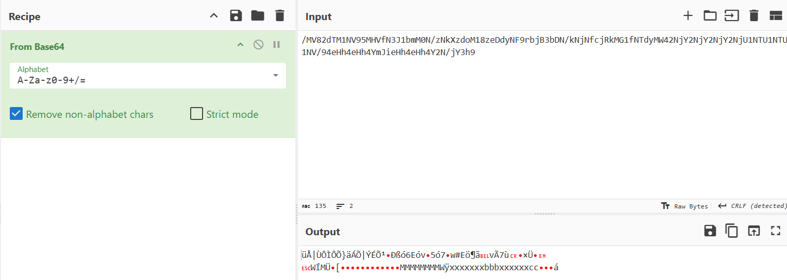

## **Challenge Name: A Little Extra Knowledge Is Too Dangerous**

### **Solves**
- **Solves**: 81
- **Points**: 200  

### **Description**
Have you ever heard the quotes, *"A little knowledge is a dangerous thing"* and *"In the land of the blind, the one-eyed man is king"*? They strike me as deeply contradictory—one condemning the slightly knowledgeable, while the other exalts them.

This contradiction highlights something unsettling: fairness doesn’t seem to exist in this world. Everyone seems to twist things to suit their own agendas, leading to divisions—arbitrary ones—where people impose their ideologies on others.
What if we eliminated excess knowledge and these divisions altogether? Perhaps then we could live like illiterate cynics—but in peace.  
That’s the essence of this challenge I’m presenting to you. Or should I call it a sermon?

**Attachments**

- [chal.txt](../challenge-files/chal.txt)

---

### **Approach**

1. **Attachment Analysis**
    - Download the attached file `chal.txt`, and looking at the text inside it looks like Base64 Encoding.
  
2. **Base64 Decoding**
    - Base64 Decoding the given file using `CyberChef` gives us an ugly output but... we can see `ACECTF{`.

    - So, one might wonder what's wrong after the 7th letter?
    - Hmm, let's analyse the challenge text to look for hints.
    - The phrase `eliminated excess knowledge and these divisions altogether` stood out. So maybe there's of extra knowledge here?
    - Maybe the `ACECTF{` part is excessive just make the flag format complete and is the extra knowledge here. Let's try to remove that bit out.

    - Umm, but we see nothing here... A base64 string starting with a `/`? Seems weird, let's try and remove that.

    - And that yielded some result! We have some part of the text decoded. So maybe we need to remove the `/`? The hint towards the removal of `divisions` also hints towards this. so, let's eliminate all the `/` from the encoded text and see if we get the flag.

    - And... we get the decoded part `1_6u355_y0u_7runc473d_7h3_3x7r4_kn0wl3d63_r4d0m_57r1n66666666666555555555_xxxxxxxbbbxxxxxxccccx}`.

### **Flag**
```
ACECTF{1_6u355_y0u_7runc473d_7h3_3x7r4_kn0wl3d63_r4d0m_57r1n66666666666555555555_xxxxxxxbbbxxxxxxccccx}
```
---
