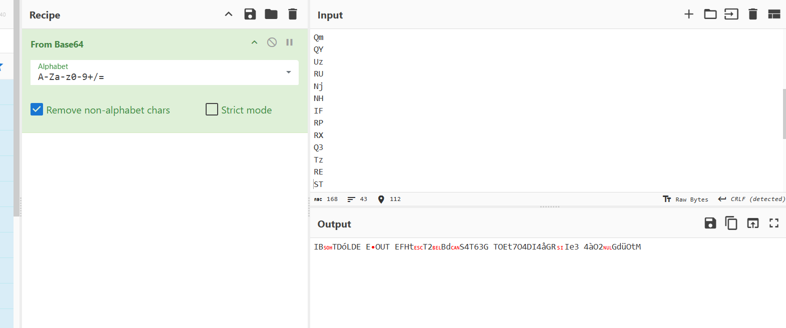

## **Challenge Name: Custom Encoding Scheme**

### **Solves**
- **Solves**: 204
- **Points**: 200  

### **Description**
I wanted to create a custom encoding for a crypto challenge but turns out, I didn't have anough time on my hands. 
So, what I did here is... Well instead of explaining it to you why don't I give you the script?

**Attachments**

- [encrypt.py](../challenge-files/encrypt.py)
- [output.txt](../challenge-files/output.txt)

---

### **Approach**

1. **Downloading Attachments**
    - Download the attached files (`encrypt.py` & `output.txt`) and open the Python script and the text file.
  
2. **Decoding the Script**
    - Looking the at `output.txt` file we see many alphanumeric values.
    - Opening the Python script, we can see the defined characterset which confirms it's Base64, then we see an obfuscated function `e1` which seems to be performing the encryption.
    - Attempting to decode the already given Base64 values would turn out to something gibberish.



3. **Reversing the Encryption**
    - At the bottom of the script we can see the following -
```python
t = "I TOLD YOU THAT BASE64 DECODING IS NO GOOD"
b = "{REDACTED}" # Should be 168 bits
o = "output.txt"

e1(t, b, o)
```
  -  From the above we can determine that the variable `t` is a string and possibly the plaintext, b is the value which is `REDACTED` and says `168 bits` so maybe it's `Binary?` and we need to get this value back, o is the `output.txt` file we already have.
  -  Further looking at the encryption function, it performs a check which is not very important. Next, the string `b` is split into `chunks of 4 characters`. The result is a list of `4-character strings` stored in `c`. Each chunk corresponds to a part of the `binary data that will be encoded`.
  - Next, the output file is opened in write mode and then the `for x, y in enumerate(t):` loop iterates over each character in the string t.
  - In the next step, these characters are converted into binary - `z = f"{ord(y):08b}"`.
  - Then, we see 
```python
if x < 42:
    a = z[:6]
    print(a)
    d = z[6:] + c[x]
```
   - This is very interesting as we can see here, that 2 six-bit values are present. One of which is plainly stored, but there other has 2 bits from the original character, and 4 bits of the `REDACTED` binary value is attached. This forms complete 12 bits and hence 2 base64 characters on each line of the output.txt file.

4. **Decrypting The Cipher**

    - So, we create a script to convert the values on each line back to their sextet values according to the `Base64` Encoding Schema. Then, extract the last 4 bits and append it in a seperate variable.
    -  After completing this for the whole of 42 characters, we get 168 bits as mentioned earlier. Converting it back to ASCII we get the flag.

Decryption Script - [decrypt.py](Resources/decrypt.py)

### **Flag**
```
ACECTF{7h47_w45_c00l}
```

---
