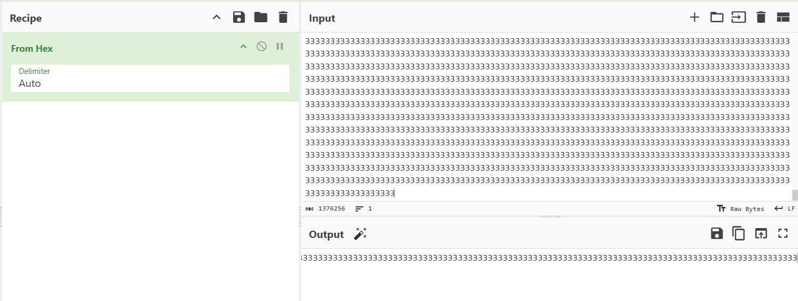
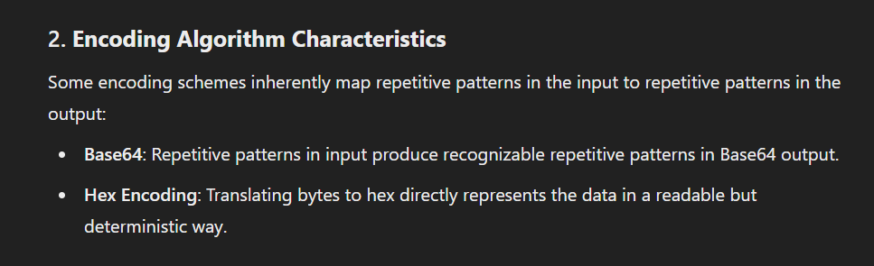
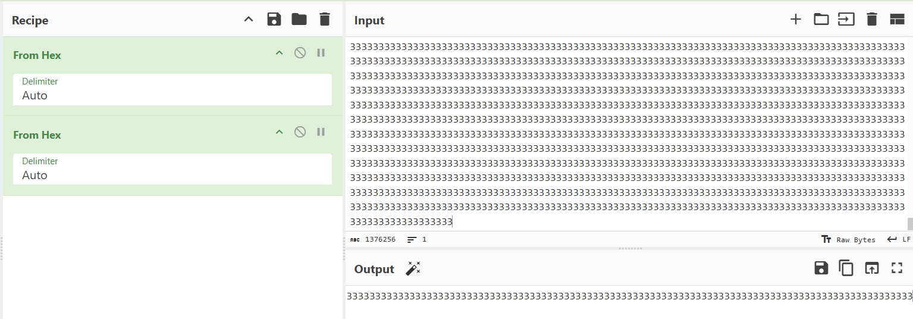
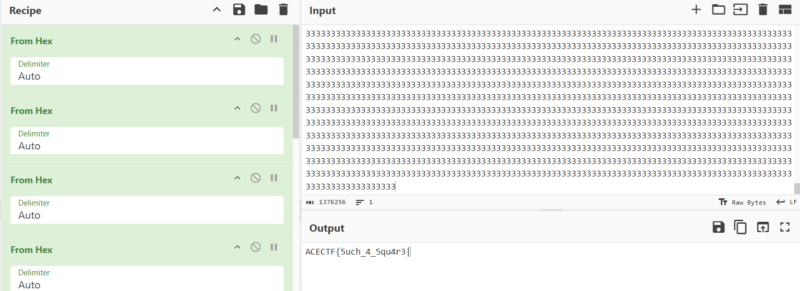

## **Challenge Name: Hexed and Squared**

### **Solves**
- **Solves**: 67
- **Points**: 300  

### **Description**
While developing these challenges, I kept in mind that some challenges should be made easy for the newbies who're gonna be playing in our CTF.
But, I'm totally against using Base64 and just giving away a flag for free. There's just no learning in that, instead what we're gonna do, 
is that we'll use a custom encoding, where we just have the number 3 due to an entropy collapse. Let's see how good your math is.

Flag Format - ACECTF{.*?}

**Attachments**
- [encoded.txt](../challenge-files/encoded.txt)

---

### **Approach**

1. **Attachment Analysis**
    - Looking at the `encoded.txt` file. We see a whole bunch of `3's`.
  
2. **Understanding the Encoding**
    - Reading the challenge header `Hexed and Squared` we can certainly predict that it's related to Hexadecimal (Base16 Encoding). But, the word `Squared` could have a lot of meanings.
    - Also, the challenge text says things like `entropy collapose` which means loss of randomness in certain encodings or ciphertexts. So, connecting these 2 deductions what could relate Hexadecimal, Squaring and loss in randomness which probably caused the repetitive `3's`.

3. **Trying out Base16**
    - Ok, so let's try and decode this string with Base16 on Cyberchef.

   - Hmm, that was interesting. The hex decoding resulted in a similar looking string but shorter in length. Maybe a bit on research as to why this happens with Hex values and when could be fruitful.
   
   - Asking ChatGPT, it tells us something of interest. What it says is that `inputting repetitive patterns produce recognizable repetitive patterns`. Isn't that what we saw when we decoded only 1 time? 
   - So, now we try to decode it again and see if we get similar pattern again.

   - And we do... This means that there might be recursve encoding in place here. Now we can think about it `Hexed and Squared` could also mean `Base 16 Squared` or `16 times Base16`. Though this is subtle but this confirms the suspicion. Now we decode this string 16 times and get the flag.
 
   - Make sure to correct it to the flag format by replacing the '|' with  '}' in the end. 

### **Flag**
```
ACECTF{5uch_4_5qu4r3}
```
---
