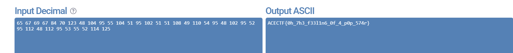

## **Challenge Name: Pipher - Piano Cipher**

### **Solves**
- **Solves**: 52
- **Points**: 300 

### **Description**
Back in my school days, we were required to pick a "Leisure Time Activity" as part of the curriculum. Four days a week, we had to attend those classes and learn whatever we chose. I opted for the piano—or more specifically, the keyboard.From junior school through high school, I gradually improved. Over time, I moved beyond simply memorizing notes and developed the ability to judge sounds and map notes instinctively, even when hearing a song for the first time. When I discovered this skill, it felt incredible.

But this joy was short-lived. My musical journey ended when I entered high school, as academics took precedence. Later, I pursued my bachelor's degree far from home, leaving my piano behind. It's a decision I've often regretted. Now, all I have are fond, fleeting memories of those starry-eyed days as a kid. In honor of that time, I've created a cipher called the Pipher. There's a bug in it, though—every 6th character of the plaintext leaks. So, yeah, it’s still a work in progress.

**Attachments**
- [cipher.txt](../challenge-files/cipher.txt)

---

### **Approach**

1. **Understanding The Cipher**
    - Opening the `cipher.txt` file we can see the `ciphertext`.
```
DC# DD# DF DD# EC '70' G#B CE F#C FC# C#C# '104' C#A FC# F#A# C#A C#A '108' CF AF# C#C FC# CE '102' FC# C#A# FC# GA# CE '112' FC# C#B C#C# C#A# GC '125'
```
   - Interesting. Reading the challenge text we know it's related to `Pianos`. After a little search we can understand that these are musical notes present on a Piano.
   - Noticing the leaked notes. We can derive that these are `Decimal` values.
```
70 - F 
104 - h
108 - l
102 - f
112 - p
```
  
2.  **Mapping The Ciphertext**
   - From these leaked mappings, we can deduce that the plaintext is the `Decimal` value for the letters. In that case let's map out all available key notes and then map them from 0-9 and see if we can get the plaintext.
```
A - 1
B - 2
C - 3
D - 4
E - 5
F - 6
G - 7
```
   - This way we can't accomodate all values and we miss out on the high(#) notes. So, let's include those too.
   - The 12 notes are C, C-Sharp (D-Flat), D, D-sharp (E-Flat), E, F, F-Sharp (G-Flat), G, G-Sharp (A-Flat), A, A-Sharp (B-Flat), and B.
   - We'll go in alphabetical order.
```
A = 1
A# = 2
B = 3
C = 4
C# = 5
D = 6
D# = 7
E = 8
F = 9
F# = 10
G = 11
G# = 12
```
   - Generating the plaintext using these mappings with the leaked values gives us.
```
65 67 69 67 84 '70' 123 48 104 95 55 '104' 51 95 102 51 51 '108' 49 110 54 95 48 '102' 95 52 95 112 48 '112' 95 53 55 52 114 125
```

3. **Decoding The Plaintext**
   Now, let's convert this back to ASCII value and see if it worked.



### **Flag**
```
ACECTF{0h_7h3_f33l1n6_0f_4_p0p_574r}
```
---
