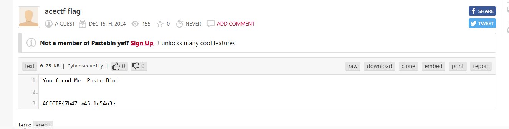

## **Challenge Name: Insanity Check**

### **Solves**
- **Solves**: 47
- **Points**: 200

### **Description**

You might've breezed through the easy Sanity Check, but this challenge is for true contenders! If you want to prove your sanity is as unhinged as mine, you’ll have to earn it.

How, you ask?

Back when we were building these CTF challenges, everyone would upload their carefully crafted puzzles, and I was the one reviewing them. But me being me—I rejected a ton of them, tossing them straight into the bin for all sorts of reasons. Naturally, my teammates started questioning my sanity, some even calling me insane. But if there was one thing that remained constant, it was the bin. Now, it’s your turn to dig in and you already know where to start... The same place where you proved you were sane!

---

### **Approach**

1. Identifying the Suspicious String:

   - We were directed to examine the server roles.
   - Upon inspection, a suspicious role was found - `r8F53sXv`.

2. Finding the User :

   - The later used description ginted towards `bin`. If we search for `bin` on Discord, we see a user named `PasteBin` on the server with this role.

3. Retrieving the User ID (Alternative Way):

   - We obtained the role ID and guild (server) ID from the Discord interface.
   - We used the Discord API v9 to retrieve the user ID (credit to xt4syyy for this specific request):
     ```
     GET [https://discord.com/api/v9/guilds/](https://discord.com/api/v9/guilds/)<guild_ID>/roles/<role_ID>/member-ids
     ```
     Specifically:
     ```
     GET [https://discord.com/api/v9/guilds/1314047484275724428/roles/1317849381084332032/member-ids](https://discord.com/api/v9/guilds/1314047484275724428/roles/1317849381084332032/member-ids)
     ```
   - This request required an `Authorization` header with a valid Discord API token.
   - Insomnia or a similar HTTP client was used to execute the request.

4. Identifying the User:

   - The API response returned the user ID associated with the role.
   - The corresponding username was "pastebin".

5. Visit the Pastebin:

   - Visiting the URL - [https://www.pastebin.com/r8F53sXv](https://www.pastebin.com/r8F53sXv) & we get the flag.

   

---

### **Flag**
```
ACECTF{7h47_w45_1n54n3}
```
---
