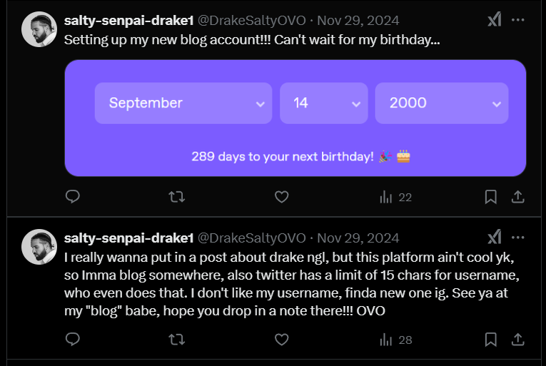
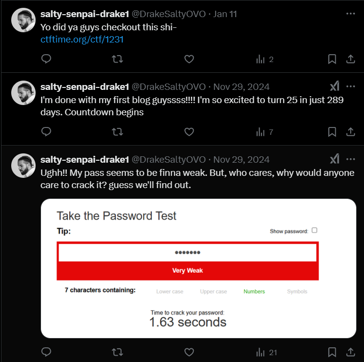
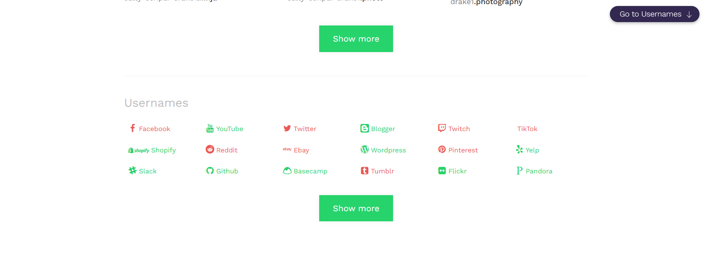
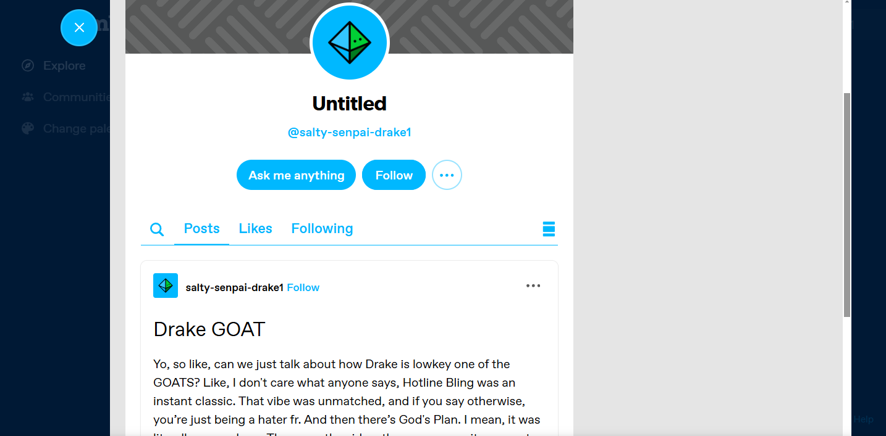
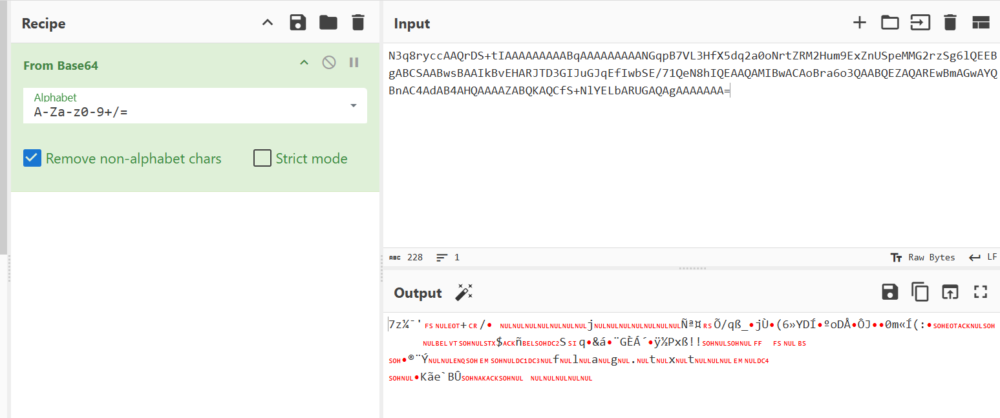

## **Challenge Name: For The Fans**  

### **Solves**  
- **Solves**: 40
- **Points**: 300  

### **Description**  

Yo, I’ve lowkey always been a Drake fan, that’s why my username’s "DrakeSaltyOVO". It was literally everywhere on my dashboard until I had to take it down 'cause people just kept hating. But, like, that’s one thing I’ve always related to with my guy Drake, and honestly, I’ve been an even bigger fan ever since. 😂 Ya, laugh all you want, but I’m literally the only one with the flag fr, rofl!  

---  

### **Approach**  

#### **Step 1: Username Investigation**  
We have a username: `DrakeSaltyOVO`. The challenge mentions "Dashboard," which likely means a social media profile. Let's start with Sherlock.  

```bash
┌──(kali㉿kali)-[~/Desktop/tmp]
└─$ sherlock DrakeSaltyOVO
```

Sherlock results:  

```
[*] Checking username DrakeSaltyOVO on:
[+] Twitter: https://x.com/DrakeSaltyOVO
[+] mastodon.cloud: https://mastodon.cloud/@DrakeSaltyOVO
[*] Search completed with 2 results
```  

The **Twitter** profile looks promising. Let's check it out.  

#### **Step 2: Twitter Profile Analysis**  

Opening the Twitter profile, we notice a lot of posts—what millennials call `yapping`.  

  

Key observations:  
- **Birthdate:** 14-09-2000  
- **Mentions setting up a blog but couldn't get the desired username**  

Scrolling further, we find another post about their **password**:  

  

- **Password Length:** 7 characters  
- **Type:** All numbers  
- **Crack time:** 1.63 seconds (super weak)  

At this point, we need to find their **blog** username.  

#### **Step 3: Finding the Blog Username**  

If you look closely, their **Twitter name** is:  
**`salty-senpai-drake1`**  

Let's run it through Sherlock to check for blogs.  

```bash
┌──(kali㉿kali)-[~/Desktop/tmp]
└─$ sherlock salty-senpai-drake1
```

Sherlock results:  

```
[*] Checking username salty-senpai-drake1 on:
[+] AllMyLinks: https://allmylinks.com/salty-senpai-drake1
[+] Discord: https://discord.com
[+] mastodon.cloud: https://mastodon.cloud/@salty-senpai-drake1
[*] Search completed with 3 results
```

No blogging platforms here. Time for **manual search** or other OSINT tools.  

Checking **Namechk**, we confirm the username exists on **Tumblr**.  

  

#### **Step 4: Checking the Tumblr Blog**  

We find the blog:  
**https://www.tumblr.com/salty-senpai-drake1**  

Scrolling through posts, we spot a **Base64 encoded string** at the bottom.  

  

```
N3q8ryccAAQrDS+tIAAAAAAAAABqAAAAAAAAANGqpB7VL3HfX5dq2a0oNrtZRM2Hum9ExZnUSpeMMG2rzSg6lQEEBgABCSAABwsBAAIkBvEHARJTD3GIJuGJqEfIwbSE/71QeN8hIQEAAQAMIBwACAoBra6o3QAABQEZAQAREwBmAGwAYQBnAC4AdAB4AHQAAAAZABQKAQCfS+NlYELbARUGAQAgAAAAAAA=
```  

#### **Step 5: Decoding the Base64 String**  

Using **CyberChef**, we decode the string.  

  

Turns out, it’s a **7z archive**. Let's save and extract it.  

```bash
┌──(kali㉿kali)-[~/Desktop/tmp]
└─$ 7z x download.7z 
```

#### **Step 6: Cracking the 7z Archive Password**  

The archive is **password-protected**.  

Since the user mentioned their **birthdate (14-09-2000)** and we know their password format (**7-digit numeric**), let’s try:  

1. `1492000`  
2. `9142000`  
3. **`2000914`** ✅ (Success!)  

```bash
┌──(kali㉿kali)-[~/Desktop/tmp]
└─$ 7z x download.7z
```

Extraction succeeds, revealing multiple files, including **flag.txt**.  

```bash
┌──(kali㉿kali)-[~/Desktop/tmp]
└─$ cat flag.txt         
ACECTF{y0u_b3773r_41nt_h4t3}
```

---

### **Flag**  
```
ACECTF{y0u_b3773r_41nt_h4t3}
```

---