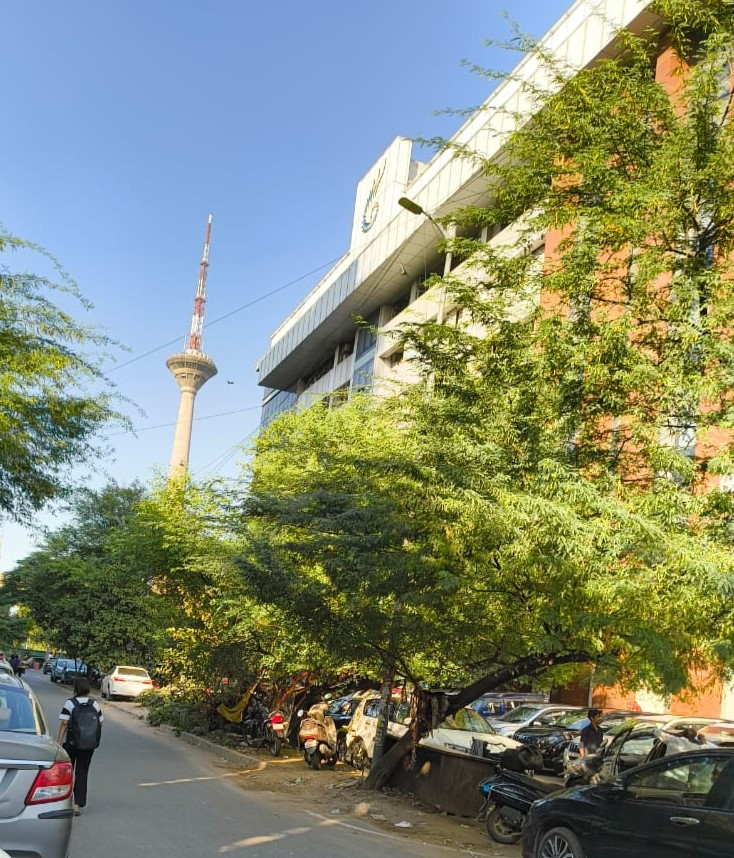
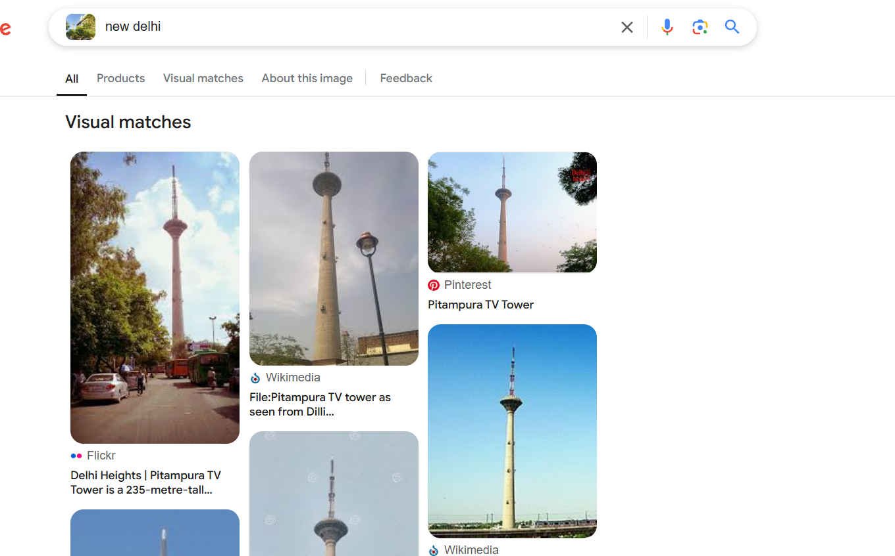
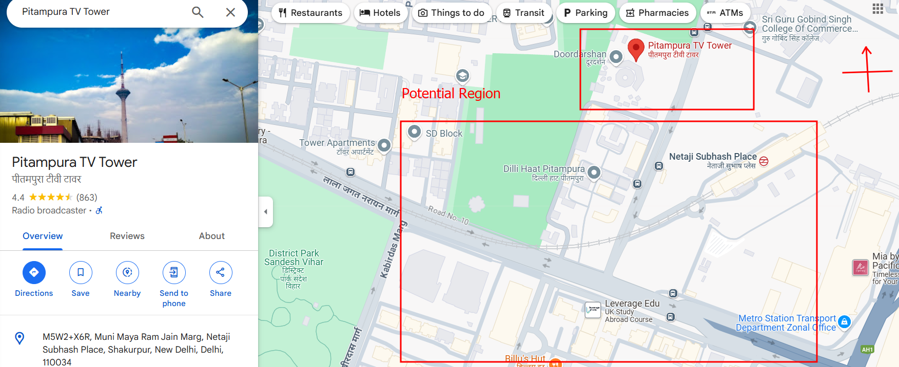
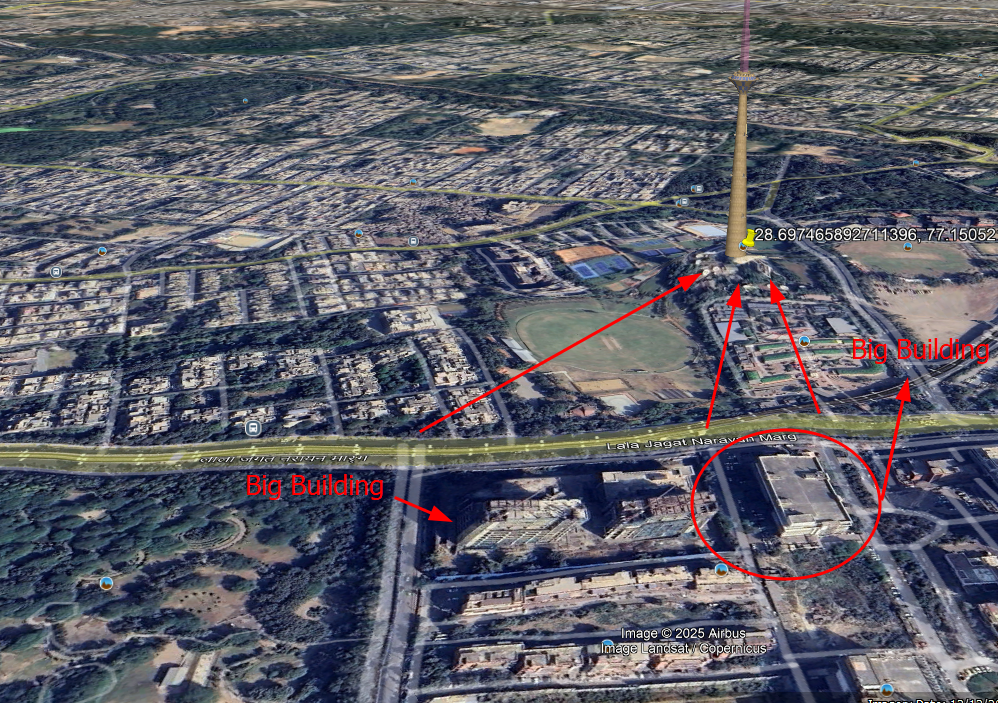
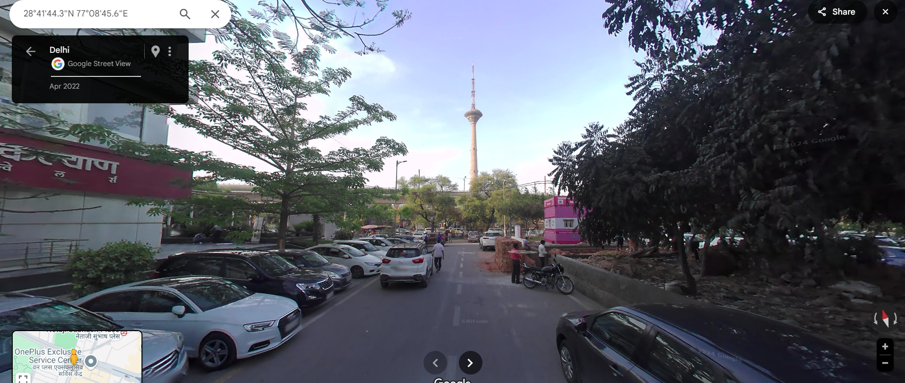
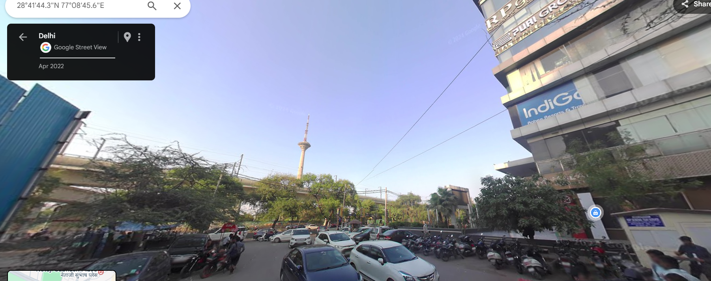
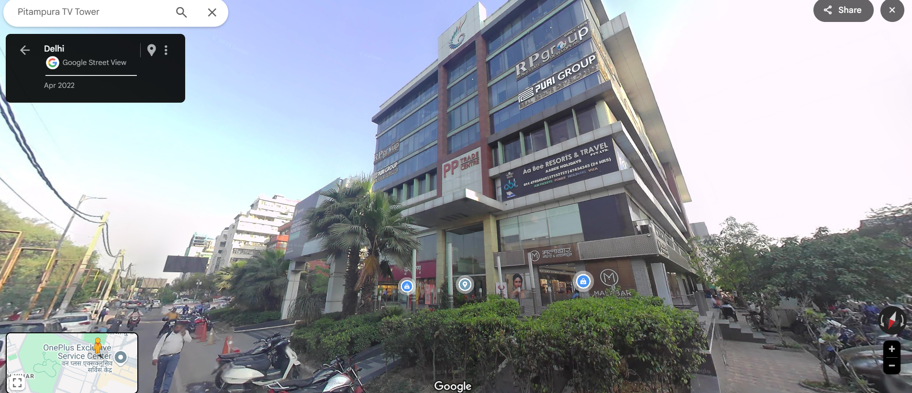

## **Challenge Name: The Mysterious Building**

### **Solves**
- **Solves**: 185
- **Points**: 300

### **Description**

Wow, that's a cool tower—I remember it well; saw it when I was on the metro one fine evening. But the building on the right... Something about its logo looks familiar, but I just can’t recall its name. 
Can you help me figure out the name of this mysterious building?



Flag format - ACECTF{building_name}. All lowercase, seperated by underscores instead of spaces. E.g. - ACECTF{white_house}

---

### **Approach**

Download the given image.

Run exiftool.

```bash
┌──(kali㉿kali)-[~/Desktop/tmp]
└─$ exiftool OSINT-1.jpg                                                                                                         
---snip---
Description                     : National Capital of India
Author                          : Описание соответствует действительности
Comment                         : Определенно не Россия
---snip---
```

Определенно не Россия - Definitely not Russia
Описание соответствует действительности - The description is true
National Capital of India - New Delhi

Ok, so we know that it's New Delhi.

Let's perform some reverse image lookup and try to find it. You'll get a lot of hits but as mentioned 'The Tower' should be our landmark here let's focus on it and search again.



And we get it - `Pitampura TV Tower`.

Now, let's open up this place in & tery to get a satellite view to match where this place could be.

As the author mentioned it's evening and they saw it through the metro. We can see the sunlight coming from the left of the screen meaning the image was taken `South` of the Tower.



Open up the tower in `Google Earth Pro` & look at the southern region we defined. We can see 3 streets which match the angle at which this image was taken. We can clearly see that the tower is a little to the right for the author in the image.



In this image we can see only 3 such streets would produce this much distance from the image. 

- The `rightmost` street is too straight for the perspective.
- The building near the `leftmost` street would block the image of the tower.
- So, our best guess is the middle street which looks very much possible and also has a building at the edge of the street.

All these streets are connected through `Lala Jagat Narayan Marg`. Let's enter street view and try to view these locatuions.

The rightmost street here is definitely not it. Let's go to the middle street now.



Ok, this one seems more possible and we also have a building to the right! Let's try & reads the building's name.



And, we found it! Building Name - `PP Trade Centre`



### **Flag**
```
ACECTF{pp_trade_centre}
```
---
