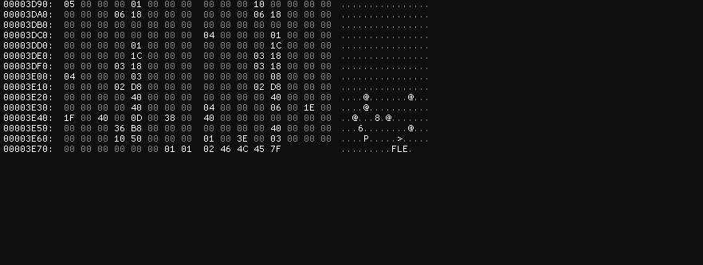

## **Challenge Name: Significance of Reversing**

### **Solves**
- **Solves**: 187
- **Points**: 200

**Attachments**

- [Reverseme.png](../challenge-files/Reverseme.png)

### **Description**

Over the years, we hackers have been reversing stuff, thinking we understand how everything works and feel good about it. But, sometimes it feels 
like do we really understand what reversing means in mordern days? Anyways, here's a PNG, let's see if you can reverse your way out of this one.

---

### **Approach**

Download the given png & trying to open it shows an error. So, we run the file command, and see that it's just `data`.

```bash
┌──(kali㉿kali)-[~/Desktop/tmp]
└─$ file Reverseme.png                  
Reverseme.png: data
```

So, let's open it up in `hex editor` and check for corrupted headers/footers.

The header seems intact but the footer was a little suspicious.



Looks like it's an ELF which has been `reversed`, so we literally have to reverse the file?

Use solve script to reverse the file - [script.py](Resources/script.py)

```bash
┌──(kali㉿kali)-[~/Desktop/tmp]
└─$ python3 script.py           
Reversed binary data saved to reverse_me
                                                                                                                                                             
┌──(kali㉿kali)-[~/Desktop/tmp]
└─$ chmod +x reverse_me 
                                                                                                                                                             
┌──(kali㉿kali)-[~/Desktop/tmp]
└─$ ./reverse_me                                 

Decrypted string: ACECTF{w3_74lk_4b0u7_r3v3r53}
```

### **Flag**
```
ACECTF{w3_74lk_4b0u7_r3v3r53}
```