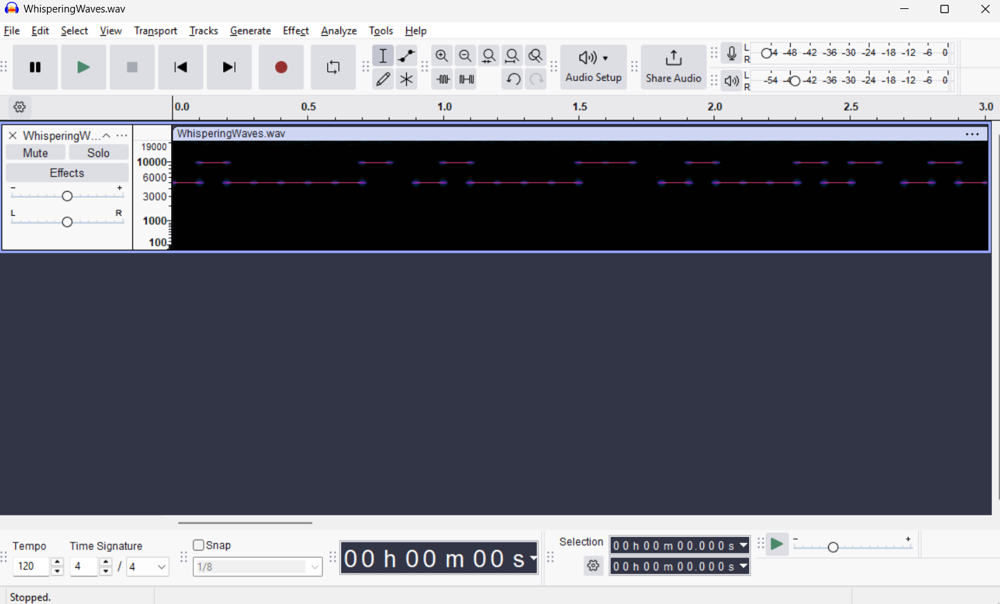

## **Challenge Name: Whispering Waves**

### **Solves**
- **Solves**: 36
- **Points**: 300  

### **Description**
Alex, a passionate linguist and culture enthusiast, frequently visits the website Francophonie.org to learn about the French-speaking world. Alex is known for their love of cryptography and steganography, often hiding messages in unsuspecting places.

---

### **Attachments**

- [WhisperingWaves.zip](../challenge-files/WhisperingWaves.zip)

---

### **Approach**

1. **Creating a Wordlist with CEWL**
    - Use the `cewl` tool to generate a custom wordlist by scraping words from Francophonie.org.
    - Command:
      ```bash
      cewl https://www.francophonie.org -w wordlist.txt
      ```
    - Let the tool run for 3 to 4 minutes to ensure it captures a comprehensive set of words.

2. **Cracking the ZIP Password**
    - Use the generated wordlist to brute-force the password-protected ZIP file with `fcrackzip`:
      ```bash
      fcrackzip -u -D -p wordlist.txt protected.zip
      ```
    - The password for the ZIP file will be revealed as **"Vierges"**.

3. **Analyzing the Extracted WAV File**
    - Extract the `.wav` file from the ZIP archive.
    - Open the `.wav` file in **Audacity** (a free, open-source audio editing software).

4. **Switching to Spectrogram View**
    - In Audacity:
      - Open the `.wav` file.
      - Switch the view from **Waveform** to **Spectrogram** by selecting the dropdown arrow next to the track name.
      
      - Select **Spectrogram**.
      
    
5. **Decoding the Binary Signal**
    - Observe the spectrogram:
      - Low-frequency signals represent `0`.
      - High-frequency signals represent `1`.
      - After every 8 bits, there will be a visible gap indicating the end of a character.
    - Manually or programmatically decode the binary values into text.

6. **Converting Binary to Text**
    - Group the binary digits into 8-bit segments.
    - Convert each binary segment to its ASCII equivalent to reveal the hidden flag.

---

### **Flag**
```
ACECTF{53cur1n6w3b}
```

---

