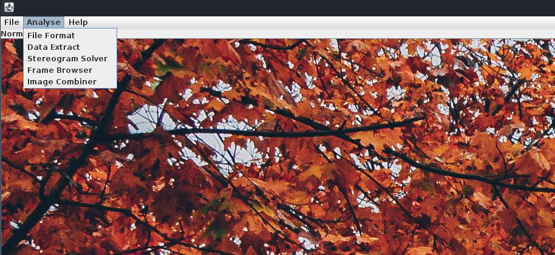
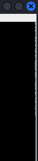

## **Challenge Name: Double Vision**

### **Solves**
- **Solves**: 11
- **Points**: 400

### **Description**
You've stumbled upon a ZIP file named `double_vision.zip`. Inside, you find two PNG images labeled `1.png` and `2.png`. While the images appear nearly identical, something unusual is hidden between them. Can you uncover the secret and retrieve the flag?

---

### **Attachments**

- [double_vision.zip](../challenge-files/DoubleVision.tar.gz)

---

### **Approach**

1. **Extract the Files**
    - Receive the ZIP file.
    - Unzip the file using the following command:
      ```bash
      unzip double_vision.zip
      ```
    - Contents of the ZIP file:
      - `1.png` (slightly smaller in size).
      - `2.png` (slightly larger in size).

2. **Compare the Two Images**
    - Inspect the files:
      - Open both `1.png` and `2.png` in an image viewer to verify that they appear visually identical.
    - Note the size difference:
      - The larger file (`2.png`) contains additional hidden data.

3. **Perform XOR Operation**
    - Use XOR operation to combine the two images:
      - Use an image analysis tool like **stegSolve**:
        - Download and run stegSolve (Java-based tool).
        - Navigate to the **Image Combiner** section.
        

      - Combine the images:
        - Load `1.png` and `2.png` into stegSolve’s combiner to reveal additional details encoded in the image.
        
      - Observe the results:
        - After combining, a white line made of dots and dashes appears on the second image.

4. **Decode the Morse Code**
    - Identify the Morse code:
      - Dots (`.`) and dashes (`-`) represent characters in Morse code.
    - Write a script to decode the Morse code:
      - This script translates the Morse code sequence into text.
    - Retrieve the flag:
      - The decoded text will reveal the flag (e.g., `ACECTFD07_D45H`).
      - Convert it to the standard flag format: `ACECTF{D07_D45H}`.

5. **Verify the Flag**
    - Double-check the decoding:
      - Ensure the Morse code sequence is entered accurately in the script.
    - Validate the decoded text to confirm it matches the expected flag format.

---

### **Key Tools Required**

1. **Image Analysis Tools**:
    - **stegSolve** for XOR operations.
---

### **Flag**
```
ACECTF{D07_D45H}
```

---

