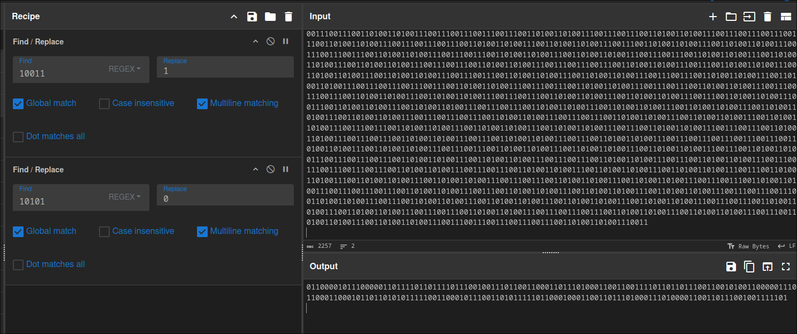

# ArchBTW

```
Final Points: 456
Difficulty: Medium
Author: proximuz
Category: Forensics
Flag: apoorvctf{ne0v1m_1s_b3tt3r}
```

Description:
`what do all these words even mean?`

### Writeup

So then. In this challenge we are given 3 files

`Capture.pcapng`
`flag.txt`
`synoonyms.txt`

Sounds good, let's go over what we find in each file.

`flag.txt` is a very long file with buncha words like

```
vibenomics
bussin
skrrt
cope
gatekeep
drippedout
goblinmode
shmoney
deadass
coomer
coomer
delulu
vibing
flex
lit
xd
... 2256 total lines
```

Interesting vocabulary to say the least.

Let's see what `synoonyms.txt` has to offer.

```
sigma
huzz
bruzz
skibidi
rizz
goofy
gyatt
npc
based
cringe
drip
cheugy
mid
chad
goblinmode
slay
yeet
bussin
vibecheck
sus
nocap
... 107 total lines
```

Again, very interesting literature.

Alright, time for the pcapng file.

Let's open it in wireshark and have a look.


Looks like a bunch of USB data. Might be something to do with USB keystrokes (no shit sherlock).

Looking a bit more into the pcap, we find that
`usb and usb and usb and usb.src == "3.45.1"` filter gives us a bunch of packets and the corresponding **HID data**.

Great, sounds like what we want. We use a HID data extractor tool to convert it into readable keystrokes!

Doing that, we get the following data.

```
nvim flag.txt
:%s/0/10101/g
:%s/1/10011/g
:%s/[01]/\=system("awk 'NR % 2 ==".(submatch(0) == "0" ? "0" : "1")."' synoonyms.txt | shuf -n1")/g
```

Seems like they opened the file `flag.txt` in neovim and ran a few commands to get it to the current state of the file.

So it is our job to reverse it and bring it back to its original form.

`:%s/[01]/\=system("awk 'NR % 2 ==".(submatch(0) == "0" ? "0" : "1")."' synoonyms.txt | shuf -n1")/g`

This command basically takes 0 and 1 from flag.txt and correspondingly replaces it with a random word in either the odd/even line from `synoonyms.txt`. Making a pretty easy python program to reverse this, we get the following file.

```
100110100110100111001110011100110100110100111001101001101001110011010011010011100110100110100111001110011010011010011100111001110011100110100110100111001101001101001110011010011010011100110100110100111001101001101001110011100111001101001101001110011100111001110011100110100110100111001110011100110100110100111001110011100111001110011010011010011100111001110011100110100110100111001101001101001110011100110100110100111001101001101001110011100111001110011010011010011100111001110011010011010011100110100110100111001110011100110100110100111001101001101001110011010011010011100111001110011010011010011100111001110011100110100110100111001110011010011010011100110100110100111001101001101001110011100111001101001101001110011010011010011100111001110011010011010011100110100110100111001110011100111001110011010011010011100111001110011010011010011100111001110011010011010011100111001110011100110100110100111001101001101001110011100111001101001101001110011010011010011100111001101001101001110011100110100110100111001101001101001110011100111001101001101001110011010011010011100110100110100111001101001101001110011010011010011100111001110011100110100110100111001110011100110100110100111001101001101001110011010011010011100111001110011010011010011100110100110100111001101001101001110011100110100110100111001110011100110100110100111001110011100110100110100111001110011010011010011100111001101001101001110011100111001110011100111001101001101001110011010011010011100111001110011010011010011100110100110100111001101001101001110011100110100110100111001110011100111001101001101001110011010011010011100111001110011010011010011100111001101001101001110011100111001110011100111001101001101001110011100111001101001101001110011010011010011100110100110100111001110011010011010011100110100110100111001101001101001110011100111001101001101001110011010011010011100111001110011010011010011100111001110011100110100110100111001110011010011010011100110100110100111001101001101001110011100111001110011010011010011100111001101001101001110011010011010011100110100110100111001101001101001110011100111001101001101001110011010011010011100111001110011010011010011100111001110011100110100110100111001101001101001110011100110100110100111001101001101001110011100111001110011100111001101001101001110011
```

Long indeed.

The other 2 commands are simple global find and replaces.

The 2nd one finds all **1**s and replaces them with **10011** and the 1st one finds all **0**s and replaces them with **10101**.

Reversing that in [CyberChef](https://gchq.github.io/CyberChef/), we get the following Binary String.

`011000010111000001101111011011110111001001110110011000110111010001100110011110110110111001100101001100000111011000110001011011010101111100110001011100110101111101100010001100110111010001110100001100110111001001111101`



Now, let's convert it from Binary and we get our flag!


Congratulations for making it this far!

Flag: `apoorvctf{ne0v1m_1s_b3tt3r}`
