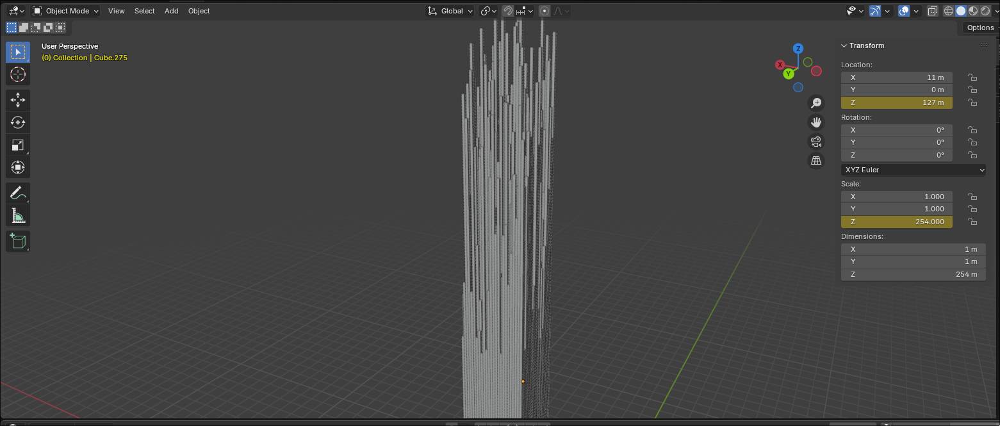
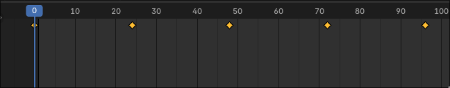

# Blend in Disguise

```
Final Points: 500
Difficulty: Medium
Author: proximuz
Category: Forensics
Flag: apoorvctf{bl3nd3r_1s_fuN}
```

Description:
`You'll never find me, I blend in so well.`

### Writeup

So then, in this challenge we are given 2 files.
`hint.txt`
`chal.blend`

The contents for `hint.txt` are as follows:

```
Gather values, sum with care,
At every key, a weight to bear.
Tip the scales—one thousand’s gate,
Decide the path, control the fate.

One side dark, the other light,
Opposing forces, black and white.
Balance shifts, the truth unveiled,
A sight well known, a tale retold.
```

Interesting, a poem.

Let's have a look at `chal.blend`

It seems like its a Blender file. So let's open it in Blender and have a look.



Seems like a bunch of vertical cubes next to each other. We see that there are total `25x25` cubes in a square formation. Interesting.

We also see that theres an animation that plays when we press `Space`. Looks like the height of the cubes change !
Let's keep this in mind.

Let's see how exactly it is being animated.
We click on a random cube and go through the `keyframes`.



We see that the animation is made out of 5 keyframes at
`0 24 48 72 96`

Interesting !

Now the question. We have all this but what to do with them??

Let's have a look at the poem in `hint.txt`

Let's go over it line by line.

`Gather values, sum with care,`

Interesting, seems like its telling us to find the values and sum them carefully.

`At every key, a weight to bear.`

So we have to sum them at every `key` which is indicating towards `keyframes`

What we infer from this is at each keyframe we find the values and sum them to get something.

Lots of some and somethings. What exactly do we sum?

In the animation we notice that 2 things change. `Z Location` and the `Z Scale`. The animation hints that it has to do something with the Height of the cube i.e. the `Z Scale`. So let's go ahead with that.

We use the following script to calculate the heights for all 25x25 cubes at a given keyframe and repeat it for all the 5 frames.

```python
import bpy
import numpy as np

#Do this for each of the 5 frames
file_path = "/tmp/cubeHeights.txt"

# Collect cube scales
cube_scales = []
for obj in bpy.data.objects:
    if obj.type == 'MESH' and "Cube" in obj.name:
        scale_z = int(round(obj.scale.z))  # Convert scale to int
        cube_scales.append(scale_z)

while len(cube_scales) < 625:
    cube_scales.append(0)
cube_scales = cube_scales[:625]

# Convert to 25x25 matrix
matrix = np.array(cube_scales).reshape(25, 25)

# Write matrix to file
with open(file_path, "w") as file:
    file.write("[\n")
    for row in matrix:
        file.write("  [" + ", ".join(map(str, row)) + "],\n")
    file.write("]\n")

print(f"Cube scales matrix saved to {file_path}")
```

Doing this, we get 5 files each having a 25x25 matrix indicating the heights for the cubes at a given keyframe.

Let's use the following script to sum all the 25x25 matrices and get a final 25x25 matrix.

```python
sum_matrix = matrix1 + matrix2 + matrix3 + matrix4 + matrix5

# Replace with the matrices obtained from previous script
matrix1 = [...]
matrix2 = [...]
matrix3 = [...]
matrix4 = [...]
matrix5 = [...]

sum_matrix = matrix1 + matrix2 + matrix3 + matrix4 + matrix5

def format_matrix(matrix):
    # Convert to integer and format properly
    formatted = "[\n"
    for row in matrix:
        formatted += "    " + str([int(x) for x in row]) + ",\n"
    formatted += "]"
    return formatted
```

Doing this, we finally get the following 25x25 matrix!

```python
final_matrix = [
    [1008, 1079, 1099, 1032, 1079, 1040, 1042, 923, 931, 996, 1015, 956, 1064, 1031, 1025, 1057, 1026, 923, 1003, 1056, 1035, 1019, 1083, 1045, 1062],
    [1071, 949, 968, 947, 960, 948, 1080, 922, 1051, 997, 1009, 930, 924, 1090, 1059, 1044, 940, 903, 1002, 950, 928, 930, 940, 938, 1041],
    [1047, 974, 1097, 1042, 1097, 944, 1077, 963, 995, 942, 957, 911, 1026, 904, 1050, 921, 967, 930, 1004, 997, 1027, 1001, 1033, 989, 1097],
    [1056, 955, 1056, 1100, 1053, 992, 1039, 901, 1060, 1004, 1034, 979, 1025, 1018, 969, 1061, 1074, 966, 1040, 908, 1078, 1012, 1059, 936, 1083],
    [1021, 984, 1089, 1050, 1049, 972, 1037, 931, 957, 1075, 993, 986, 904, 957, 1019, 938, 1013, 935, 1008, 953, 1013, 1029, 1082, 949, 1028],
    [1094, 943, 901, 973, 973, 983, 1083, 988, 1004, 1049, 966, 1027, 1015, 935, 988, 1097, 1029, 977, 1066, 991, 993, 921, 910, 901, 1023],
    [1037, 1013, 1043, 1043, 1010, 1026, 1016, 979, 1074, 989, 1040, 940, 1075, 971, 1073, 955, 1062, 975, 1042, 1080, 1070, 1043, 1027, 1056, 1100],
    [929, 921, 991, 957, 921, 958, 968, 985, 964, 1011, 1091, 1094, 929, 941, 1016, 979, 917, 934, 959, 994, 988, 978, 992, 945, 945],
    [1099, 1096, 1023, 1040, 1005, 986, 1079, 1087, 1040, 1004, 935, 1093, 959, 1021, 1012, 1024, 1018, 1042, 974, 1061, 948, 1007, 989, 1086, 911],
    [1038, 986, 1082, 1034, 946, 1053, 926, 900, 1063, 999, 1010, 937, 1073, 924, 1036, 919, 914, 1042, 990, 1002, 920, 904, 1067, 968, 932],
    [1069, 915, 922, 906, 947, 915, 1080, 951, 934, 924, 1067, 967, 943, 1066, 986, 1098, 954, 933, 978, 933, 1076, 941, 1082, 1005, 1071],
    [1065, 969, 1019, 1056, 903, 982, 951, 996, 916, 980, 971, 998, 1004, 909, 1076, 1062, 1001, 1098, 939, 1051, 952, 908, 991, 978, 1006],
    [1069, 1037, 1068, 1024, 1100, 1089, 1094, 981, 997, 1011, 1014, 982, 1061, 920, 1047, 1046, 980, 1086, 1064, 998, 1084, 1075, 1057, 992, 1085],
    [1065, 1093, 911, 975, 1044, 941, 929, 1098, 913, 906, 973, 977, 983, 1001, 1089, 954, 1046, 948, 946, 1033, 921, 986, 1085, 1085, 978],
    [1002, 927, 1096, 990, 907, 1087, 1047, 981, 901, 944, 1095, 1035, 1034, 1050, 1062, 1016, 948, 924, 1017, 922, 938, 935, 1070, 1042, 1011],
    [1013, 995, 1060, 1077, 954, 929, 975, 1074, 1061, 1051, 1016, 1074, 943, 926, 1011, 937, 1063, 904, 963, 1097, 949, 961, 926, 1049, 1012],
    [1022, 949, 941, 1015, 1077, 1074, 1083, 933, 1069, 965, 1049, 1001, 1041, 1025, 1076, 966, 1052, 1048, 1018, 1060, 1040, 925, 1072, 907, 1034],
    [938, 920, 985, 926, 984, 922, 974, 934, 1001, 1029, 1049, 957, 1043, 984, 928, 1013, 1003, 992, 974, 911, 1008, 1079, 991, 991, 940],
    [1056, 1028, 1075, 1085, 1032, 1004, 1044, 989, 1047, 952, 1056, 959, 993, 1088, 1026, 909, 1040, 947, 1025, 929, 1060, 1013, 1022, 1024, 1009],
    [1071, 970, 919, 974, 974, 954, 1088, 943, 996, 1032, 948, 958, 956, 964, 971, 932, 1031, 930, 918, 989, 1089, 933, 955, 1056, 1020],
    [1073, 900, 1065, 1031, 1057, 982, 1055, 985, 1096, 1075, 942, 1028, 943, 1080, 1078, 1047, 1009, 1099, 1044, 1004, 1089, 963, 1037, 959, 907],
    [1059, 973, 1036, 1025, 1031, 983, 1078, 973, 1023, 989, 993, 1099, 953, 949, 1020, 910, 1096, 1065, 1010, 1061, 1066, 956, 903, 1061, 1001],
    [1002, 934, 1046, 1032, 1007, 925, 1091, 925, 1067, 1099, 1084, 951, 1007, 980, 1097, 1094, 967, 935, 947, 1018, 981, 1036, 1067, 987, 1089],
    [1096, 905, 922, 984, 988, 938, 1026, 944, 1090, 934, 930, 1036, 903, 999, 1095, 955, 1063, 1094, 956, 1064, 1084, 909, 972, 987, 1087],
    [1002, 1059, 1076, 1097, 1046, 1016, 1044, 953, 1069, 990, 998, 1030, 1061, 980, 1063, 1091, 925, 982, 1009, 929, 929, 1032, 1033, 1016, 1059],
]
```

Looks good, now let's go back to the poem.

```
Tip the scales—one thousand’s gate,
Decide the path, control the fate.

One side dark, the other light,
Opposing forces, black and white.
Balance shifts, the truth unveiled,
A sight well known, a tale retold.
```

`Tip the scales at one thousand's gate.`
Seems like they want us to split the values into something at 1000.

```
One side dark, the other light
Opposing forces, black and white.
```

Interesting, this hints us that we take the 25x25 matrix and then for each value >= 1000 we paint it black and for each value <1000 we paint it white.

`A sight well known` hints at it being a **QR code** because what else is Black and white and square :)

Let's use the following program to turn it into a QR.

```python
from PIL import Image
import numpy as np

def generate_qr_from_matrix(matrix):
    size = len(matrix)  # Assuming a square matrix (25x25)
    scale = 10  # Scale factor for better visibility
    img_size = size * scale

    img = Image.new("1", (img_size, img_size), "white")  # 1-bit image (black & white)
    pixels = img.load()

    for i in range(size):
        for j in range(size):
            color = 0 if matrix[i][j] > 1000 else 1  # Black if >= 1000, white otherwise
            for x in range(scale):
                for y in range(scale):
                    pixels[j * scale + x, i * scale + y] = color

    img.show()
    img.save("qr_code.png")

final_matrix = [...] # Put the previously obtained matrix here
generate_qr_from_matrix(test_matrix)
```

Doing this, we get the following image and it is infact something we recognize instantly !


Scanning this, we get the flag `apoorvctf{bl3nd3r_1s_fuN}`!

Hope you liked this challenge :)
