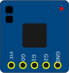
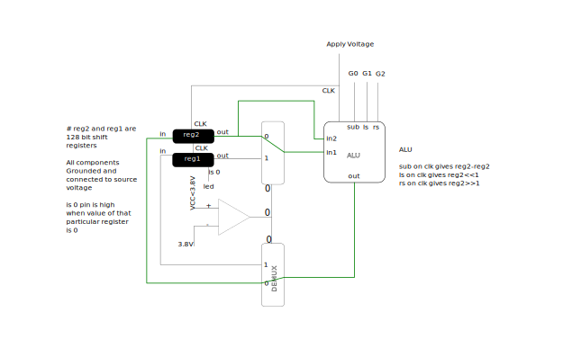
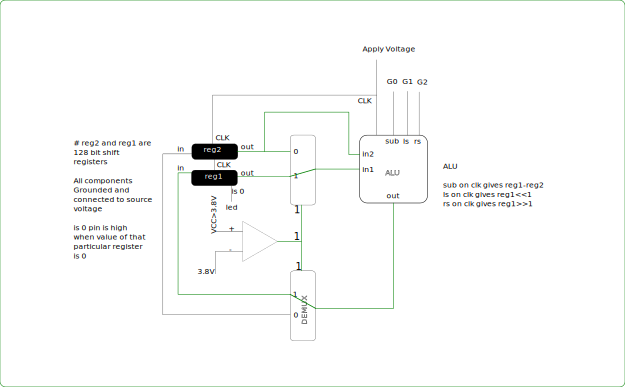

# Secret Guarding Itself

**Author:** Eappen  
**Points:** 500  
**Difficulty:** Hard  
**Category:** Hardware

## Description

In the neon-drenched underbelly of Akihabara City, the rogue AI **KAI-7** has locked away the final activation sequence for the legendary **Mecha-Seraphim**. The code is hidden within a mysterious hardware module, a relic of a bygone era, its secrets buried beneath layers of encrypted registers and tangled circuitry.

The system allows interaction through designated control lines, but direct access to the core memory is impossible. However, whispers among underground netrunners speak of a flaw in the architecture, a secret buried in the circuits—one that could be exploited by those with sharp eyes and a deeper understanding of hardware design.

A lone indicator flickers within the circuitry, revealing traces of life beneath the metal. The ancient masters spoke of a ritual: a relentless cycle, a blade honed against an unseen force, until the final cut exposes the hidden truth. Those who uncover the pattern will hold the key to reversing time itself—restoring the lost knowledge hidden within the machine’s very foundation.

The fate of **Mecha-Seraphim** lies in your hands. **Observe. Decipher. Exploit.**

**Note:** Flag format is `apoorvctf{key}`  

##### Given Files

1. 
2. 
3. 

---
**Flag:**apoorvctf{b7x9p_2dn_u}
## Solution

Players were provided with:

- An **abstract circuit diagram**
- A **diagram of the CPU**
- A **Python script** to convert decimal to string

All components were grounded and connected to a **3.3V** operating voltage. **Register1** and **Register2** were 128-bit registers with some values stored in them. By default, **Register2** was read/write enabled, but **Register1** could neither be read nor written to directly. **Register2** could only be modified by applying high voltages to the GPIO pins.

The default value stored in **Register2** was visible to the user:

```
5162464270738828797634643
```

Converting this decimal value to a string resulted in gibberish.

### Steps

1. **Identify the Glitch**  
   A careful analysis of the circuit diagram revealed the presence of a **comparator**. By applying a voltage greater than **3.8V** to the non-inverting pin, the comparator output was driven **high**, altering the **ALU operations** to:

VCC<3.8


VCC>3.8

   ```
   GPIO0: reg1 = reg1 - reg2
   GPIO1: reg1 = reg1 << 1
   GPIO2: reg1 = reg1 >> 1
   ```

2. **Observe LED Blinks**  
   The LED blinked when **Register1** reached `0`. To determine the **maximum value** of Register1, players could repeatedly **right-shift Register1**:

   ```
   n = Number of times Register1 was right-shifted before the LED blinked
   max value = (2^n) - 1
   ```

3. **Find the Key Factor**  
   The key insight was understanding the relationship between **Register2** and **Register1**:

   ```
   reg1 = k * reg2
   ```

   To find `k`, players had to **continuously subtract Register2 from Register1** and count the number of times until the LED blinked. That count represented `k`, which turned out to be **23**.

4. **Reverse the Operation**  
   The original value of `Register1` could then be reconstructed:

   ```
   reg2 * 23 = 118736678226993062345596789
   ```

5. **Convert to ASCII**  
   Using the provided **Python script** to convert this decimal value to a character stream **revealed the flag**:
```python
def dec_to_string(dec):
    binary = str(bin(dec)).replace("b","")
    text = ''.join(chr(int(binary[i:i+8], 2)) for i in range(0, len(binary), 8))
    return text

print(dec_to_string(118736678226993062345596789))
```

**Output**
   ```
   b7x9p_2dn_u
   ```

---

## Final Flag

```
apoorvctf{b7x9p_2dn_u}
```

---

## Additional Notes

This process of **shifting and subtracting repeatedly** is the **ritual** mentioned in the challenge description—the relentless cycle that ultimately reveals the hidden truth.

Massive respect to everyone who solved or at least attempted this puzzle. It was designed to push players into thinking about **low-level hardware exploits** and **circuit manipulation**.

If you have any **queries** or insights, feel free to raise them. Additionally, if you discovered any **alternative methods** to retrieve the flag, I’d love to hear about them!

**Thanks for hacking it!**  
**-Eappen**

