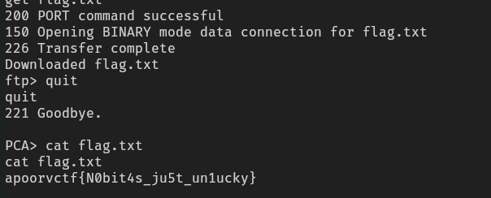

# Nobita's Network Nightmare

## Description

Nobita was given a simple task: update the company’s internal network drive. It stored important files that everyone needed. He didn’t understand much about networks, but he wanted to prove he could handle it.

Without checking the instructions, he pressed a few buttons and messed the network up. The shared ftp drive disappeared. Within minutes, employees started complaining.

Gian and Suneo, who relied on the files, stormed into the IT room. “What did you do?” they demanded. Nobita panicked and called Dekisugi.

Help Dekisugi fix the network!

> [!NOTE]  
> nc chals2.apoorvctf.xyz 3000

> **Author:** _hampter & NotAProton_

## Solution

The challenge requires you to open the map.pkt given in Cisco Packet Tracer.

Then netcat to the given address.

```bash
nc chals2.apoorvctf.xyz 3000
```

and fix the network as follows:

### Step 1: Configure SwitchA to enable PCA's connection

```bash
3                    # Select switchA
enable               # Enter privileged mode
configure terminal   # Enter configuration mode
interface fa1/4      # Configure port connected to PCA
no shutdown          # Enable the port
exit                 # Return to config mode
exit                 # Return to privileged mode
exit                 # Return to device selection
```

### Step 2: Configure RouterA to enable RouterB's connection

```bash
4                    # Select RouterA
enable               # Enter privileged mode
configure terminal   # Enter configuration mode
interface fa1/0      # Configure RouterA's interface
no shutdown          # Enable the interface
exit                 # Return to config mode
interface fa0/0      # Interface that will connect to RouterB
ip address 10.100.100.1 255.255.255.0  # Set IP
no shutdown          # Enable the interface
exit                 # Return to config mode
ip route 192.168.1.0 255.255.255.0 10.100.100.2  # Route to server network
exit                 # Return to device selection
```

### Step 3: Configure RouterB to route back to RouterA's network

```bash
5                    # Select RouterB
enable               # Enter privileged mode
configure terminal   # Enter configuration mode
interface fa0/0      # Configure interface connected to RouterA
ip address 10.100.100.2 255.255.255.0  # Set IP
no shutdown          # Enable the interface
exit                 # Return to config mode
ip route 178.34.0.0 255.255.0.0 10.100.100.1  # Route to PCA's network
exit                 # Return to device selection
```

### Step 4: Configure PCA and get the flag

```bash
1                    # Select PCA
ipconfig 178.34.23.9 255.255.0.0 10.45.23.23  # Set gateway to RouterA
ping 192.168.1.5     # Test connectivity to server
ftp 192.168.1.5      # Connect to FTP server
secret               # Username
donttellanyone       # Password
get flag.txt         # Download the flag file
quit                 # Exit FTP
cat flag.txt         # Read the flag
```

And you will get the flag: `apoorvctf{N0bit4s_ju5t_un1ucky}`

