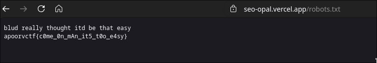
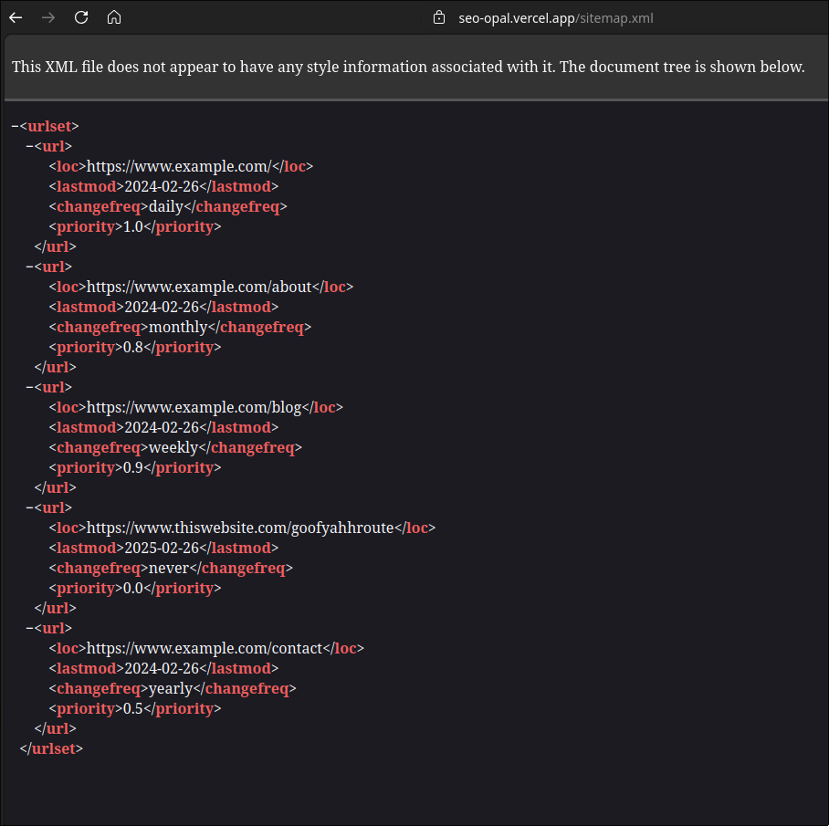
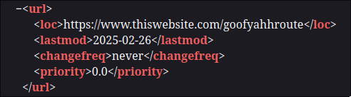
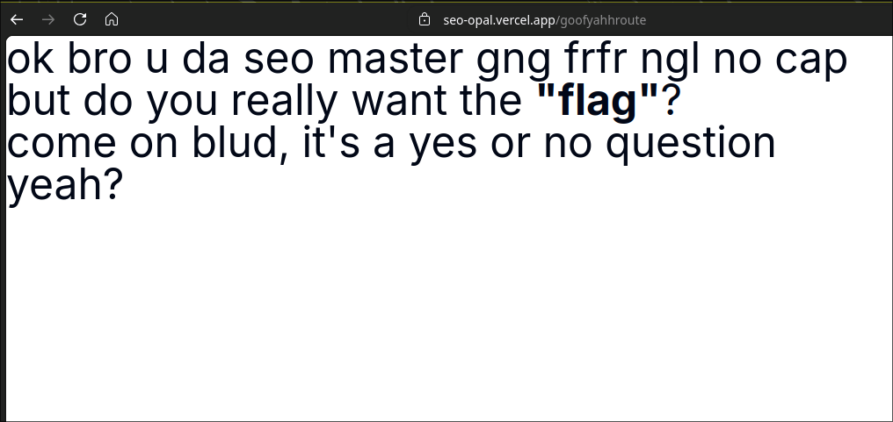
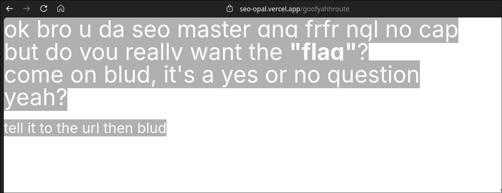
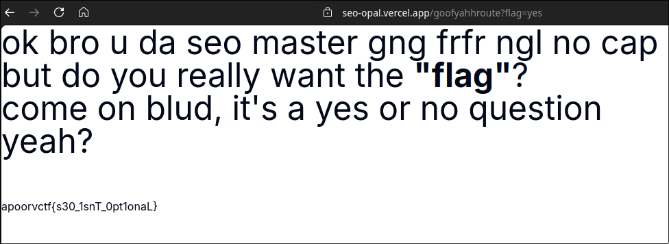

# SEO CEO

```
Final Points: 50
Difficulty: Easy
Author: proximuz
Category: Web Exploitation
Flag: apoorvctf{s30_1snT_0pt1onaL}
```

Description:
`They're optimizing SEO to show this garbage?!`

### Writeup

We are given a website link and that's it.
`https://seo-opal.vercel.app`

Upon visiting the website, we are greeted with a bad landing page about SEO. Seems like the company really cares about SEO.


Interesting. If they really care so much about SEO, they wouldve done something about the SEO of this website too.

Let's start by visiting `robots.txt` a common path for web crawlers to visit.



Finally we find the flag! Oops, its a fake flag. Yeah no way itd be that easy.

Let's look for other common SEO routes. Upon a quick google search, we find another common route, the `sitemap.xml`. This is a common route to display the map of the website and the importance of each route. Let's try visiting that route.



Great, we see a bunch of example.com routes, but one of them stands out.



Interesting. What is at `/goofyahhroute`. Let's go and check.



Great literature.

Upon pressing `Ctrl+A` we find some text in white color, showing us some hidden text.



`tell it to the url then blud`. This hints us to add the URL param of `?flag=yes`. So let's go ahead and do that.

Doing that, we get our flag!



Pretty easy and fun web challenge :)

Flag: `apoorvctf{s30_1snT_0pt1onaL}`
