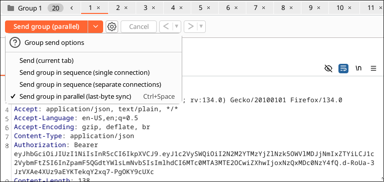

# Blog-1 Writeup

## 1. Introduction  
The challenge is about a blog website that allows users to add blogs. Additionally, there is a **daily reward section** where a user can claim a gift after posting **5 blogs**. However, only **one blog is allowed per day**.  

## 2. Important APIs  

- **`/api/v1/blog/addBlog`** – Used to add a new blog post.  
- **`/api/v2/gift`** – Used to claim the daily reward.  
- **`/api/v1/gift`** – Another endpoint related to gift claiming.  

## 3. Reconnaissance & Understanding the API 
- While posting a blog, we observed that it **takes more time than usual** to process.  
- This delay suggests that the server might be performing multiple operations, making it a potential target for a race condition.  
- API endpoints involved in the race condition.  

## 4. Exploiting the Race Condition  

- Tools used : BurpSuite

- Intercepting the Request and using repeater to send the requests.
- 
- 

- Done!!! Note: If you had problems with the racecondition, try removing **connection: keep alive** header from the request.
- 

-  
- This was a fake link with skibidi toilet meme.

- 
- change v2 to v1 in the URL using burp or any tool.

- 
