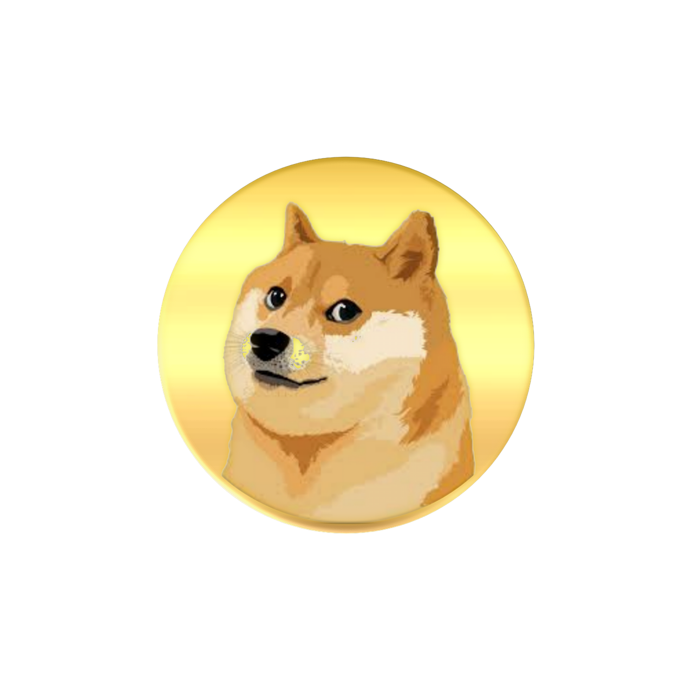

# DogeCoin

Total Solves - 207

Final Points - 100

## Description
If DogeCoin had a counterfeit, this is probably it. Looks same but maybe isn't...

## Attachment


## Writeup

The image has LSB steganography. You can use [zsteg](https://github.com/zed-0xff/zsteg) to find the flag.

```bash
zsteg chall.png
```

You will get a [base32](https://en.wikipedia.org/wiki/Base32) encoded string. To decod use

```bash
echo 'INXWIZLGMVZXIQ2UIZ5TKMLNOBWDGX3MONRF6NJXGNTTAX3GOR3X2===' | base32 -d
```

## Flag
`CodefestCTF{51mpl3_lsb_573g0_ftw}`
