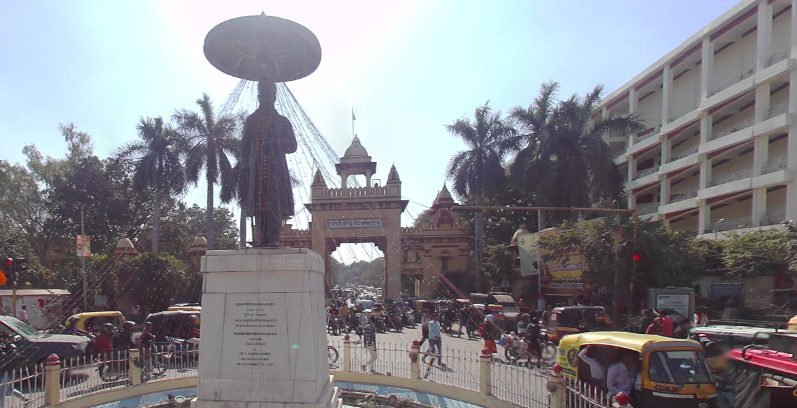

# College

Total Solves - 109

Final Points - 100

## Description

Find the coordinates from where the picture was taken rounded upto 4 decimal places.

FLAG FORMAT - `CodefestCTF{latitude_longitude}`

## Writeup

Reverse image will give you approximate location. Going to google street view will give you exact same photo [here](https://www.google.com/maps/@25.2779318,83.002362,3a,75y,207.72h,89.73t/data=!3m7!1e1!3m5!1sM_R-x5mPASf6pe7h1Q3c5Q!2e0!6shttps:%2F%2Fstreetviewpixels-pa.googleapis.com%2Fv1%2Fthumbnail%3Fcb_client%3Dmaps_sv.tactile%26w%3D900%26h%3D600%26pitch%3D0.27348022873016475%26panoid%3DM_R-x5mPASf6pe7h1Q3c5Q%26yaw%3D207.72053300364234!7i13312!8i6656?entry=ttu&g_ep=EgoyMDI1MDEyMi4wIKXMDSoASAFQAw%3D%3D).

Now important part was to ***roundoff*** to 4 digits.

## Flag
`CodefestCTF{25.2779_83.0024}`