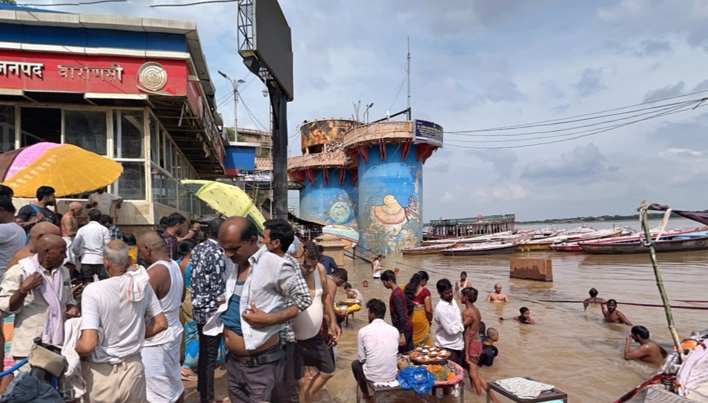

# KVT

Total Solves - 100

Final Points - 100

## Description

Find the coordinates from where the picture was taken rounded upto 4 decimal places.

FLAG FORMAT - `CodefestCTF{latitude_longitude}`

## Writeup

Reverse image will give you approximate location. Going to google street view will give you exact same photo [here](https://www.google.com/maps/@25.3070687,83.0103974,3a,75y,45.66h,89.03t/data=!3m8!1e1!3m6!1sAF1QipNEVkJUOiBV0-b-tZJSna-Yg0zeQZgRa6Ypbi5T!2e10!3e11!6shttps:%2F%2Flh3.googleusercontent.com%2Fp%2FAF1QipNEVkJUOiBV0-b-tZJSna-Yg0zeQZgRa6Ypbi5T%3Dw900-h600-k-no-pi0.9676444526927241-ya281.6618494299403-ro0-fo100!7i4608!8i2304?entry=ttu&g_ep=EgoyMDI1MDEyMi4wIKXMDSoASAFQAw%3D%3D).

Now important part was to ***roundoff*** to 4 digits.

## Flag
`CodefestCTF{25.3071_83.0104}`