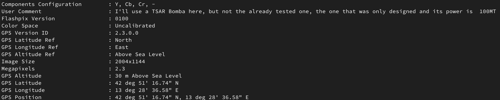
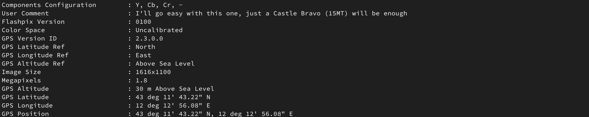
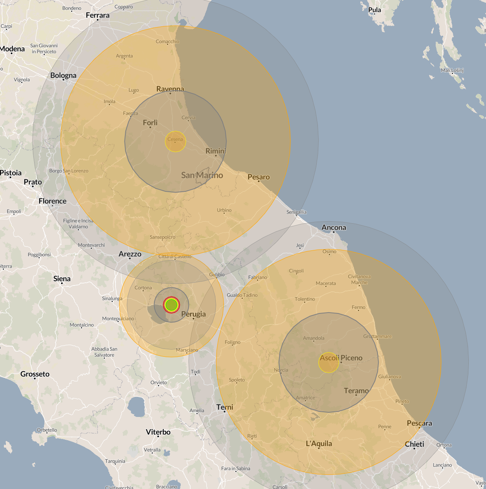

# Romagnol Prometheus
## Challenge
This challenge includes three images representing three Italian locations that can be identified using the **GPS coordinates** saved within the [metadata](https://en.wikipedia.org/wiki/Metadata) of the images. Along with these coordinates, there are also **comments** specifying the type of nuclear bomb that *Mattia* has decided to drop on that location. The goal of the challenge is to discover the location **bombed by all three devices**.

## Solution
The first step to solving the challenge is to extract some data from the images to better understand the next steps.

* Result of the analysis of the first image

* Result of the analysis of the second image

* Result of the analysis of the third image

| Image | Coordinate                         | Bomb              |
|:-----:|------------------------------------|-------------------|
|   1   | 42° 51' 16.74" N, 13° 28' 36.58" E | TSAR 100MT        |
|   2   | 43° 11' 43.22" N, 12° 12' 56.08" E | Castle Bravo 15MT |
|   3   | 44° 8' 28.83" N, 12° 14' 24.84" E  | TSAR 100MT        |

Once the coordinates of the areas to be bombed have been identified, you just need to use [`NukeMap`](https://nuclearsecrecy.com/nukemap/) to note that the blast radius of the various atomic bombs coincides with the unlucky city of Gubbio. Therefore, this name must be entered in the format `pascalCTF{}` to obtain the required flag, i.e., `pascalCTF{gubbio}`.

## Author
**Author**: [`@Mark-74`](https://github.com/Mark-74/)  
**Date**: 2025-01-12  
**Category**: Miscellaneous