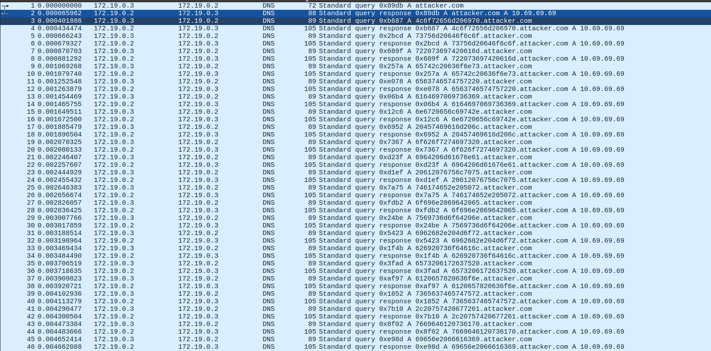

# DNS e pancetta
## Challenge
This challenge, as could be inferred from its name, involves [DNS Beaconing](https://medium.com/@letshackit/dns-beaconing-definition-and-detection-6a12f975f35e), a technique used by malware and attackers to *exfiltrate* data and send it to their server through **DNS requests**.

To solve this challenge, it was specifically necessary to split each domain requested by the DNS using the `.` character and extract the first hexadecimal part. Once all the parts were concatenated in *chronological order*, the flag could be obtained simply by converting the hexadecimal text into ASCII.

## Solution
```py
import pyshark, re

capture = pyshark.FileCapture('misc3.pcapng', display_filter='dns.a') # open file and get all requests
regex = r'pascalCTF{.*?}' # regex to match flag format

flag = ''
for packet in capture:
    query : str = packet.dns.qry_name
    if len(data := query.split('.')) == 3:
        flag += data[0]

flag = bytes.fromhex(flag).decode('utf-8') # convert hex to ascii
print(re.findall(regex, flag)[0]) # print the flag
```

## Author
**Author**: [`@AlBovo`](https://github.com/AlBovo/) <br>
**Date**: 2024-10-03 <br>
**Category**: Miscellaneous