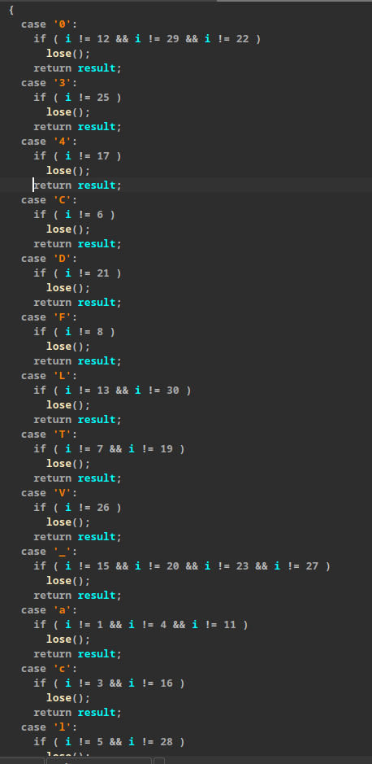

# Switcharoo
## Challenge
This challenge involves a straightforward flag check using a switch-case structure. While the task isn't overly difficult, it does require reversing the code to determine the correct index for each specific character. This can be achieved by analyzing the decompiled code using tools like IDA or Ghidra.



P.S.: I personally feel sorry for anyone who actually wasted time trying to solve this (thanks tho).

## Solution
```py
#!/usr/bin/env python3
flag = ['']*32

flag[1] = flag[4] = flag[11] = 'a'
flag[7] = flag[19] = 'T'
flag[17] = '4'
flag[24] = 'r'
flag[18] = 'n'
flag[3] = flag[16] = 'c'
flag[5] = flag[28] = 'l'
flag[0] = flag[10] = 'p'
flag[2] = 's'
flag[6] = 'C'
flag[21] = 'D'
flag[14] = 'o'
flag[8] = 'F'
flag[13] = flag[30] = 'L'
flag[26] = 'V'
flag[12] = flag[29] = flag[22] = '0'
flag[9] = '{'
flag[118 ^ 0x69] = '}'
flag[15] = flag[20] = flag[23] = flag[27] = '_'
flag[25] = '3'

print(''.join(flag))
```

## Author
**Author**: [`@Giak777`](https://github.com/Giak777/) <br>
**Date**: 2024-11-14 <br>
**Category**: Reverse Engineering