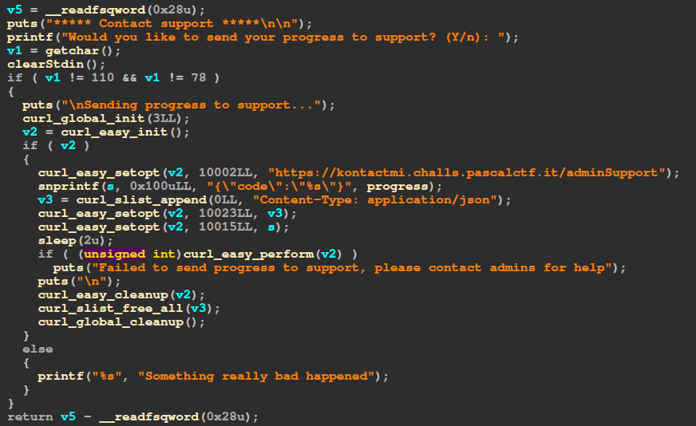

# Challenge

This challenge lets us play a game on a gameboy and collect collectibles.
Whenever a collectible is collected, part of a code gets added to our current code; this code, then, can be sent to an admin through a post request for him to evaluate it.



# Solution
The endpoint where the code is sent supports not only POST requests, but also GET requests.
So, if we make a GET request to the same endpoint, it responds with the correct code.
We can then send the correct code to get the flag.

```python
import requests

code = requests.get(f"https://kontactmi.challs.pascalctf.it/adminSupport").json()['response']

flag = requests.post(f"https://kontactmi.challs.pascalctf.it/adminSupport", json={"code":code}).text
print(flag)
```