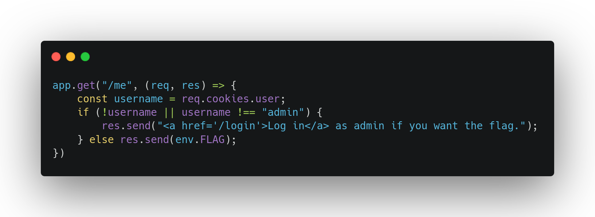

# Biscotto
## Challenge
Biscotto's backend contains only two functions:

* The `/login` endpoint, which allows users to log in as long as the username is not 'admin'.
* The `/me` endpoint, which displays the flag if the user is 'admin'.



The vulnerability lies in the **me** function, where the session cookie, which is not encrypted, is used to verify the actual username. To obtain the flag, one simply needs to modify the 'user' cookie, setting its value to *admin* to access the flag

## Solution
```sh
#!/bin/sh
curl --cookie "user=admin" http://localhost:8001/me
```

## Author
**Author**: [`@ale18V`](https://github.com/ale18V/) <br>
**Date**: 2024-11-13 <br>
**Category**: Web Security