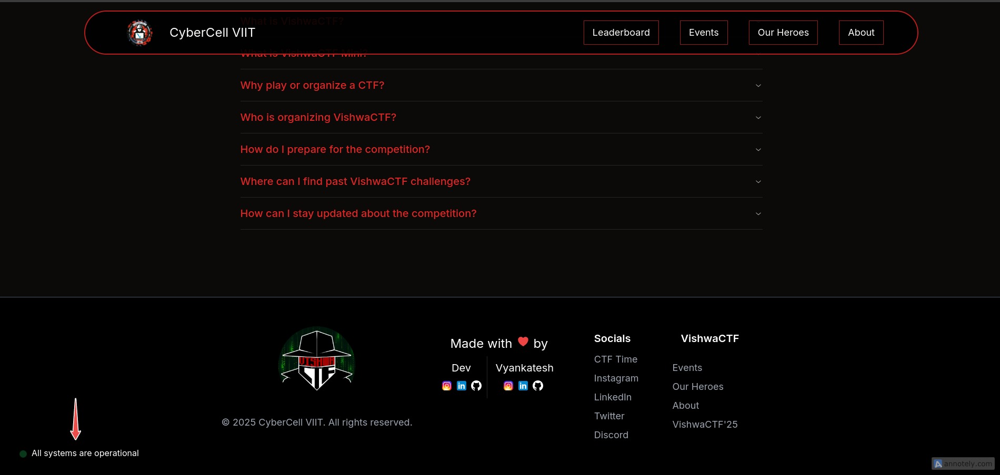
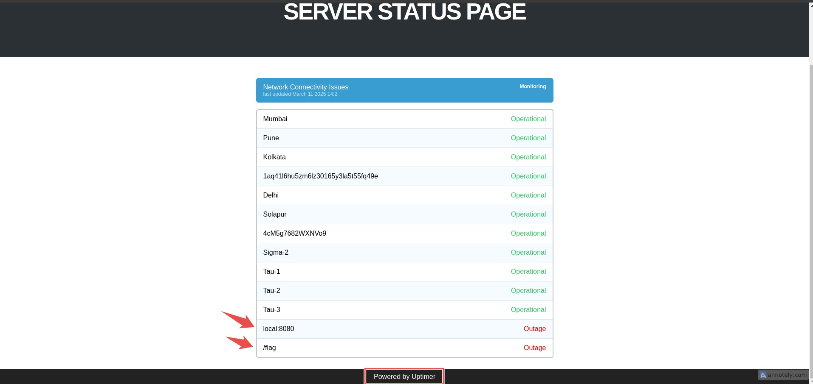
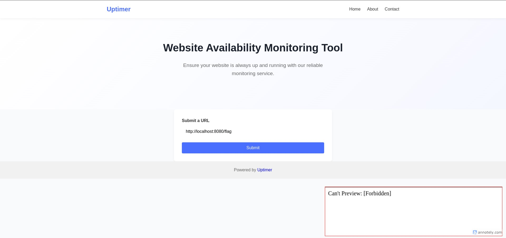
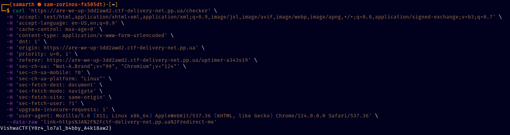

# Challenge Name: [Are We Up?]

## Challenge Overview

- **Category:** [Web]

- **Difficulty:** [Hard]

- **Author:** [Samarth Ghante | @ark.dev]

## Description

_No Description & No Link Provided_

## Solution

### Step 1: Check VishwaCTF Website's Footer

[`Are-We-Up` Hints You To Check Server Status, Clearly Websites Add Their Server Status In The Footer Section, This Leads To The Challenge Link -> `https://are-we-up-3dd2awd2.ctf-delivery-net.pp.ua/`]

### Step 2: Ignore The Decoys And Follow The Link

[As Annotated in the given screenshot, the footer [`uptimer`] leads to website availability monitoring status tool. (following the story)]

### Step 3: Access The Forbidden

[According to the hints on the server status page, the flag located at `http://localhost:8080/flag`, But It is blocked by the monitoring server, so setup a redirect server [302] or DNS rebinding to bypass.]

### Step 4: Get The Flag

[I have set up the redirection and got the flag!]

