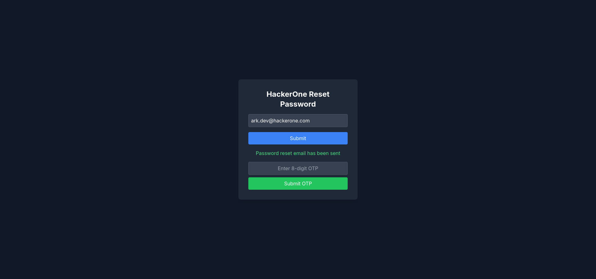

## Challenge Name: [forgot-h1-login]

## Challenge Overview

- **Category:** [Web]

- **Difficulty:** [Hard]

- **Author:** [Samarth Ghante | @ark.dev]

## Description

[ark.dev forgot his HackerOne username and password, help him!!]

## Solution

### Step 1: Explore the Website.

#### _Looks like there is a login page_

#### _No credentials seem to work_

#### _Login button's `onClick` functions reveals that there is `/dashboard` page_

#### _Found a email address at `/dashboard`_

[Email: `ark.dev@hackerone.com`]

#### _Back to reset password page, getting error `email not found` for own emails_

#### _Except that, It is sending the reset code `ark.dev@hackerone.com`_

#### _It sending the email in the payload_

---

### Step 2: Modify the payload.

[Convert the payload into an array of emails, including ours]

### Step 3: Avoid Decoys & look for the flag.

[It worked, we got the email]

[But wait, there is no flag, let's look in the headers.]

[Flag: `VishwaCTF{y0u_4r3_7h3_h4ck3r_numb3r_0n3_2688658}`]

---

## Thanks for Reading!

If you enjoyed this write-up, feel free to connect with me on [LinkedIn](https://www.linkedin.com/in/samarth-ghante).
