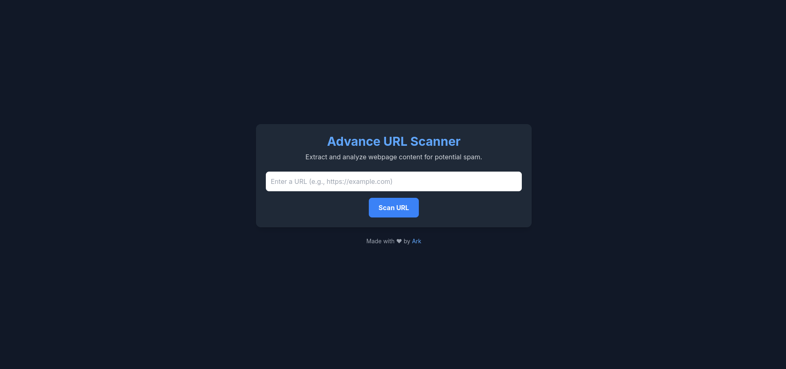
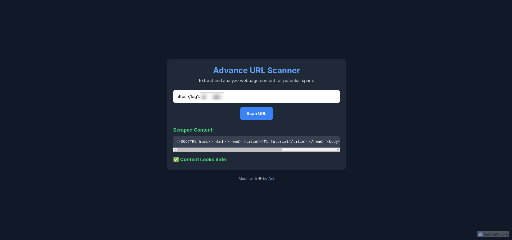
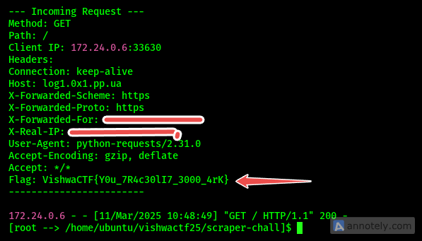

# Challenge Name: [Scan-It-To-Stay-Safe]

## Challenge Overview

- **Category:** [Web]

- **Difficulty:** [Easy]

- **Author:** [Samarth Ghante | @ark.dev]

## Description

_No Description Was Provided_

## Solution

### Step 1: Analyze The Website.

[Looks like this site is acessing and scraping the given links, And marks it safe or unsafe]

### Step 2: May be the site is leaking something.

[Setup your own web/http server and monitor the requests]

### Step 3: Put the server link in the url section.

### Step 4: Parse the heeaders & Get the flag.

